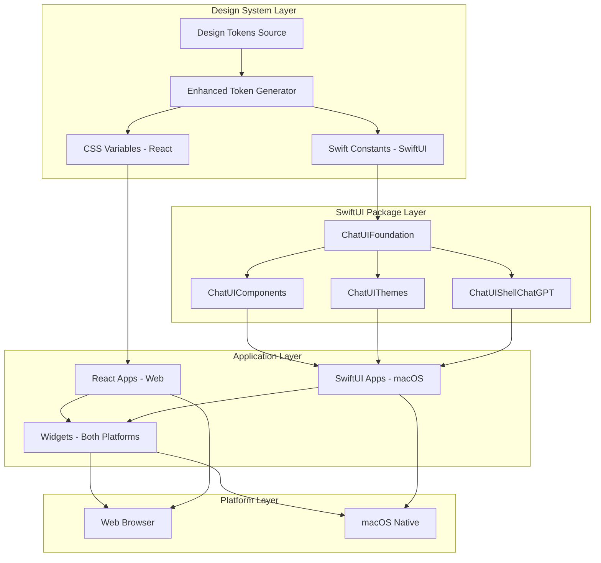

# Design Document: Native macOS Bridge

## Overview

The Native macOS Bridge enables the ChatUI system to run natively on macOS through a modular SwiftUI library architecture. The system is built around four core Swift packages that provide a scalable foundation for native macOS development while maintaining perfect design consistency with the existing React web application.

The architecture separates concerns into distinct, reusable packages:

1. **ChatUIFoundation**: Semantic tokens and platform utilities
2. **ChatUIComponents**: Reusable SwiftUI primitives that mirror React APIs  
3. **ChatUIThemes**: Theme presets including pixel-perfect ChatGPT styling
4. **ChatUIShellChatGPT**: Optional complete application shell layouts

This approach ensures visual consistency, eliminates JavaScriptCore complexity, and provides a clean foundation for both custom native macOS applications and pixel-perfect ChatGPT-style experiences.

## Architecture

The system follows a modular package architecture with clear separation of concerns:



### Core Principles

1. **Modular Architecture**: Each package has a single, clear responsibility
2. **Token-Driven Consistency**: All visual constants derive from shared design tokens
3. **Platform-Native Feel**: SwiftUI components follow macOS design patterns
4. **Incremental Adoption**: Packages can be adopted independently
5. **Zero Breaking Changes**: Existing React applications remain unaffected

## Components and Interfaces

### Package Architecture Overview

The SwiftUI library is organized into four distinct packages, each with specific responsibilities:

#### ChatUIFoundation Package

**Purpose**: Provides semantic design tokens and platform utilities
**Dependencies**: None (foundation layer)
**Location**: `swift/ChatUIFoundation/`

```swift
// swift/ChatUIFoundation/Sources/ChatUIFoundation/FColor.swift
import SwiftUI

public enum FColor {
    // Surfaces - backed by Asset Catalog with light/dark variants
    public static let bgApp = Color("foundation-bg-app")            // window background
    public static let bgCard = Color("foundation-bg-card")          // section card background
    public static let bgCardAlt = Color("foundation-bg-card-alt")   // hover/pressed overlay base
    
    // Text
    public static let textPrimary = Color("foundation-text-primary")
    public static let textSecondary = Color("foundation-text-secondary")
    public static let textTertiary = Color("foundation-text-tertiary")
    
    // Icons
    public static let iconPrimary = Color("foundation-icon-primary")
    public static let iconSecondary = Color("foundation-icon-secondary")
    public static let iconTertiary = Color("foundation-icon-tertiary")
    
    // Accents
    public static let accentGreen = Color("foundation-accent-green")
    public static let accentBlue = Color("foundation-accent-blue")
    public static let accentOrange = Color("foundation-accent-orange")
    public static let accentRed = Color("foundation-accent-red")
    public static let accentPurple = Color("foundation-accent-purple")
    
    // Dividers/borders
    public static let divider = Color("foundation-divider")
    
    // Automatically supports light/dark mode through Asset Catalog
}

// swift/ChatUIFoundation/Sources/ChatUIFoundation/FType.swift
import SwiftUI

public enum FType {
    // Pixel-close to React components (SF Pro, small negative tracking)
    public static func title() -> Font { .system(size: 16, weight: .semibold) }
    public static func sectionTitle() -> Font { .system(size: 13, weight: .semibold) }
    
    public static func rowTitle() -> Font { .system(size: 14, weight: .regular) }
    public static func rowValue() -> Font { .system(size: 14, weight: .regular) }
    
    public static func caption() -> Font { .system(size: 12, weight: .regular) }
    public static func footnote() -> Font { .system(size: 12, weight: .regular) }
    
    // Tracking for pixel-close text rendering
    public static func trackingRow() -> CGFloat { -0.3 }
    public static func trackingCaption() -> CGFloat { -0.2 }
}

// swift/ChatUIFoundation/Sources/ChatUIFoundation/FSpacing.swift
import Foundation

public enum FSpacing {
    public static let s2: Double = 2
    public static let s4: Double = 4
    public static let s8: Double = 8
    public static let s12: Double = 12
    public static let s16: Double = 16
    public static let s24: Double = 24
    public static let s32: Double = 32
}

// swift/ChatUIFoundation/Sources/ChatUIFoundation/Platform.swift
import SwiftUI

public enum Platform {
    public static var isMac: Bool {
        #if os(macOS)
        true
        #else
        false
        #endif
    }
}
```

#### ChatUIComponents Package

**Purpose**: Reusable SwiftUI primitives that mirror React component APIs
**Dependencies**: ChatUIFoundation, ChatUIThemes
**Location**: `swift/ChatUIComponents/`

**Settings Primitives** (First Deliverable):

```swift
// swift/ChatUIComponents/Sources/ChatUIComponents/SettingsDivider.swift
import SwiftUI
import ChatUIFoundation
import ChatUIThemes

public struct SettingsDivider: View {
    @Environment(\.colorScheme) private var scheme
    
    public init() {}
    
    public var body: some View {
        Rectangle()
            .fill(FColor.divider)
            .opacity(scheme == .dark ? ChatGPTTheme.dividerOpacityDark : ChatGPTTheme.dividerOpacityLight)
            .frame(height: 1)
    }
}

// swift/ChatUIComponents/Sources/ChatUIComponents/SettingsCardView.swift
public struct SettingsCardView<Content: View>: View {
    private let content: Content
    @Environment(\.colorScheme) private var scheme
    
    public init(@ViewBuilder content: () -> Content) {
        self.content = content()
    }
    
    public var body: some View {
        VStack(spacing: 0) {
            content
        }
        .background(FColor.bgCard)
        .clipShape(RoundedRectangle(cornerRadius: ChatGPTTheme.cardCornerRadius, style: .continuous))
        .overlay(
            RoundedRectangle(cornerRadius: ChatGPTTheme.cardCornerRadius, style: .continuous)
                .stroke(FColor.divider.opacity(scheme == .dark ? ChatGPTTheme.cardBorderOpacityDark : ChatGPTTheme.cardBorderOpacityLight),
                        lineWidth: 1)
        )
    }
}

// swift/ChatUIComponents/Sources/ChatUIComponents/SettingRowView.swift
public enum SettingTrailing {
    case none
    case chevron
    case text(String)
    case custom(AnyView)
}

public struct SettingRowView: View {
    private let icon: AnyView?
    private let title: String
    private let subtitle: String?
    private let trailing: SettingTrailing
    private let action: (() -> Void)?
    
    @Environment(\.colorScheme) private var scheme
    @State private var isHovering = false
    
    public init(
        icon: AnyView? = nil,
        title: String,
        subtitle: String? = nil,
        trailing: SettingTrailing = .none,
        action: (() -> Void)? = nil
    ) {
        self.icon = icon
        self.title = title
        self.subtitle = subtitle
        self.trailing = trailing
        self.action = action
    }
    
    public var body: some View {
        Group {
            if let action {
                Button(action: action) {
                    rowContent
                }
                .buttonStyle(.plain)
            } else {
                rowContent
            }
        }
        #if os(macOS)
        .onHover { isHovering = $0 }
        #endif
        .background(rowBackground)
        .clipShape(RoundedRectangle(cornerRadius: ChatGPTTheme.rowCornerRadius, style: .continuous))
        .padding(.horizontal, 6) // matches "inset hover" look
    }
    
    private var rowContent: some View {
        HStack(spacing: 12) {
            if let icon {
                icon
                    .frame(width: ChatGPTTheme.rowIconSize, height: ChatGPTTheme.rowIconSize)
                    .foregroundStyle(FColor.iconSecondary)
            }
            
            VStack(alignment: .leading, spacing: 2) {
                Text(title)
                    .font(FType.rowTitle())
                    .foregroundStyle(FColor.textPrimary)
                    .tracking(FType.trackingRow())
                
                if let subtitle {
                    Text(subtitle)
                        .font(FType.caption())
                        .foregroundStyle(FColor.textTertiary)
                        .tracking(FType.trackingCaption())
                }
            }
            
            Spacer(minLength: 10)
            
            trailingView
        }
        .padding(.horizontal, ChatGPTTheme.rowHPadding)
        .padding(.vertical, ChatGPTTheme.rowVPadding)
        .contentShape(Rectangle())
    }
    
    @ViewBuilder
    private var trailingView: some View {
        switch trailing {
        case .none:
            EmptyView()
        case .chevron:
            Image(systemName: "chevron.right")
                .font(.system(size: ChatGPTTheme.rowChevronSize, weight: .semibold))
                .foregroundStyle(FColor.iconTertiary)
        case .text(let value):
            Text(value)
                .font(FType.rowValue())
                .foregroundStyle(FColor.textSecondary)
                .tracking(FType.trackingRow())
        case .custom(let any):
            any
        }
    }
    
    private var rowBackground: some View {
        Group {
            if Platform.isMac && isHovering {
                RoundedRectangle(cornerRadius: ChatGPTTheme.rowCornerRadius, style: .continuous)
                    .fill(FColor.bgCardAlt)
                    .opacity(scheme == .dark ? ChatGPTTheme.hoverOverlayOpacityDark : ChatGPTTheme.hoverOverlayOpacityLight)
            } else {
                Color.clear
            }
        }
    }
}

// swift/ChatUIComponents/Sources/ChatUIComponents/FoundationSwitchStyle.swift
public struct FoundationSwitchStyle: ToggleStyle {
    public init() {}
    
    public func makeBody(configuration: Configuration) -> some View {
        HStack {
            configuration.label
            Spacer(minLength: 0)
            ZStack {
                Capsule()
                    .fill(configuration.isOn ? FColor.accentGreen : FColor.bgCardAlt)
                    .frame(width: 42, height: 22)
                Circle()
                    .fill(Color.white)
                    .shadow(color: .black.opacity(0.18), radius: 1, x: 0, y: 1)
                    .frame(width: 18, height: 18)
                    .offset(x: configuration.isOn ? 10 : -10)
                    .animation(.easeInOut(duration: 0.15), value: configuration.isOn)
            }
            .contentShape(Rectangle())
            .onTapGesture { configuration.isOn.toggle() }
            .accessibilityLabel(Text(configuration.isOn ? "On" : "Off"))
        }
    }
}

// swift/ChatUIComponents/Sources/ChatUIComponents/SettingToggleView.swift
public struct SettingToggleView: View {
    private let icon: AnyView?
    private let title: String
    private let subtitle: String?
    @Binding private var isOn: Bool
    
    public init(icon: AnyView? = nil, title: String, subtitle: String? = nil, isOn: Binding<Bool>) {
        self.icon = icon
        self.title = title
        self.subtitle = subtitle
        self._isOn = isOn
    }
    
    public var body: some View {
        SettingRowView(
            icon: icon,
            title: title,
            subtitle: subtitle,
            trailing: .custom(
                AnyView(
                    Toggle("", isOn: $isOn)
                        .labelsHidden()
                        .toggleStyle(FoundationSwitchStyle())
                )
            ),
            action: nil
        )
    }
}

// swift/ChatUIComponents/Sources/ChatUIComponents/SettingDropdownView.swift
public struct SettingDropdownView: View {
    private let icon: AnyView?
    private let title: String
    private let subtitle: String?
    private let options: [String]
    @Binding private var selection: String
    
    public init(
        icon: AnyView? = nil,
        title: String,
        subtitle: String? = nil,
        options: [String],
        selection: Binding<String>
    ) {
        self.icon = icon
        self.title = title
        self.subtitle = subtitle
        self.options = options
        self._selection = selection
    }
    
    public var body: some View {
        SettingRowView(
            icon: icon,
            title: title,
            subtitle: subtitle,
            trailing: .custom(AnyView(menuTrailing)),
            action: nil
        )
    }
    
    private var menuTrailing: some View {
        Menu {
            ForEach(options, id: \.self) { opt in
                Button(opt) { selection = opt }
            }
        } label: {
            HStack(spacing: 8) {
                Text(selection)
                    .font(FType.rowValue())
                    .foregroundStyle(FColor.textSecondary)
                    .tracking(FType.trackingRow())
                
                ZStack {
                    Circle().fill(FColor.bgCardAlt)
                        .frame(width: 18, height: 18)
                    Image(systemName: "chevron.down")
                        .font(.system(size: 11, weight: .semibold))
                        .foregroundStyle(FColor.iconSecondary)
                }
            }
        }
        .menuStyle(.borderlessButton) // macOS
    }
}
```

#### ChatUIThemes Package

**Purpose**: Theme presets including ChatGPT-style visual constants
**Dependencies**: ChatUIFoundation
**Location**: `swift/ChatUIThemes/`

```swift
// swift/ChatUIThemes/Sources/ChatUIThemes/ChatGPTTheme.swift
import SwiftUI

public enum ChatGPTTheme {
    // MARK: - Radii
    public static let appCornerRadius: CGFloat = 18
    public static let cardCornerRadius: CGFloat = 12
    public static let rowCornerRadius: CGFloat = 10
    public static let pillCornerRadius: CGFloat = 999
    
    // MARK: - Shadows
    public static let appShadowOpacity: Double = 0.45
    public static let appShadowRadius: CGFloat = 30
    public static let appShadowYOffset: CGFloat = 18
    
    // MARK: - Borders
    public static let cardBorderOpacityLight: Double = 0.35
    public static let cardBorderOpacityDark: Double = 0.20
    public static let dividerOpacityLight: Double = 0.35
    public static let dividerOpacityDark: Double = 0.25
    
    // MARK: - Row metrics
    public static let rowHPadding: CGFloat = 12
    public static let rowVPadding: CGFloat = 10
    public static let rowIconSize: CGFloat = 18
    public static let rowChevronSize: CGFloat = 14
    
    // MARK: - Hover / pressed overlays
    public static let hoverOverlayOpacityLight: Double = 0.55
    public static let hoverOverlayOpacityDark: Double = 0.55
    public static let pressedOverlayOpacityLight: Double = 0.70
    public static let pressedOverlayOpacityDark: Double = 0.70
}

public enum DefaultTheme {
    // Native macOS styling
    public static let cardRadius: CGFloat = 8
    public static let buttonRadius: CGFloat = 6
    public static let inputRadius: CGFloat = 8
    
    // Subtle shadows
    public static let cardShadow = Color.black.opacity(0.05)
    public static let cardShadowRadius: CGFloat = 4
    public static let cardShadowOffset = CGSize(width: 0, height: 1)
    
    // Native materials
    public static let sidebarMaterial = Material.sidebar
    public static let backgroundMaterial = Material.windowBackground
    
    // Standard macOS spacing
    public static let messageSpacing: CGFloat = 12
    public static let sectionSpacing: CGFloat = 20
    public static let containerPadding: CGFloat = 16
}
```

#### ChatUIShellChatGPT Package

**Purpose**: Optional complete application shell layouts
**Dependencies**: ChatUIFoundation, ChatUIComponents, ChatUIThemes
**Location**: `swift/ChatUIShellChatGPT/`

```swift
// swift/ChatUIShellChatGPT/Sources/ChatUIShellChatGPT/VisualEffectView.swift
#if os(macOS)
import AppKit
import SwiftUI

public struct VisualEffectView: NSViewRepresentable {
    let material: NSVisualEffectView.Material
    let blendingMode: NSVisualEffectView.BlendingMode
    
    public init(
        material: NSVisualEffectView.Material = .sidebar,
        blendingMode: NSVisualEffectView.BlendingMode = .behindWindow
    ) {
        self.material = material
        self.blendingMode = blendingMode
    }
    
    public func makeNSView(context: Context) -> NSVisualEffectView {
        let view = NSVisualEffectView()
        view.material = material
        view.blendingMode = blendingMode
        view.state = .active
        return view
    }
    
    public func updateNSView(_ nsView: NSVisualEffectView, context: Context) {
        nsView.material = material
        nsView.blendingMode = blendingMode
    }
}
#else
// iOS fallback
import SwiftUI

public struct VisualEffectView: View {
    let material: Material
    
    public init(material: Material = .sidebar) {
        self.material = material
    }
    
    public var body: some View {
        Rectangle()
            .fill(.background)
            .background(material)
    }
}
#endif

// swift/ChatUIShellChatGPT/Sources/ChatUIShellChatGPT/RoundedAppContainer.swift
import SwiftUI
import ChatUIFoundation
import ChatUIThemes

public struct RoundedAppContainer<Content: View>: View {
    @ViewBuilder let content: () -> Content
    
    public init(@ViewBuilder content: @escaping () -> Content) {
        self.content = content
    }
    
    public var body: some View {
        content()
            .clipShape(RoundedRectangle(cornerRadius: ChatGPTTheme.appCornerRadius, style: .continuous))
            .overlay(
                RoundedRectangle(cornerRadius: ChatGPTTheme.appCornerRadius, style: .continuous)
                    .stroke(FColor.divider.opacity(0.2), lineWidth: 1)
            )
            .shadow(
                color: Color.black.opacity(ChatGPTTheme.appShadowOpacity),
                radius: ChatGPTTheme.appShadowRadius,
                x: 0,
                y: ChatGPTTheme.appShadowYOffset
            )
    }
}

// swift/ChatUIShellChatGPT/Sources/ChatUIShellChatGPT/AppShellView.swift
import SwiftUI
import ChatUIFoundation
import ChatUIComponents
import ChatUIThemes

public struct AppShellView<SidebarContent: View, DetailContent: View>: View {
    @ViewBuilder let sidebarContent: () -> SidebarContent
    @ViewBuilder let detailContent: () -> DetailContent
    
    public init(
        @ViewBuilder sidebar: @escaping () -> SidebarContent,
        @ViewBuilder detail: @escaping () -> DetailContent
    ) {
        self.sidebarContent = sidebar
        self.detailContent = detail
    }
    
    public var body: some View {
        NavigationSplitView {
            sidebarContent()
                .frame(minWidth: 280, idealWidth: 320, maxWidth: 400)
                #if os(macOS)
                .background(VisualEffectView(material: .sidebar))
                #else
                .background(FColor.bgApp)
                #endif
        } detail: {
            detailContent()
                #if os(macOS)
                .background(VisualEffectView(material: .windowBackground))
                #else
                .background(FColor.bgApp)
                #endif
        }
        .navigationSplitViewStyle(.balanced)
    }
}
```

### Enhanced Token Generation System

The token generator is enhanced to output both CSS and Swift Asset Catalog formats from the same source:

```typescript
// packages/tokens/src/generators/enhanced-token-generator.ts
export interface AssetCatalogColorSet {
  light: string;
  dark: string;
}

export interface AssetCatalogStructure {
  [colorSetName: string]: AssetCatalogColorSet;
}

export class EnhancedTokenGenerator {
  async generateCSS(tokens: DesignTokens): Promise<string> {
    // Existing CSS generation (unchanged)
    return `
:root {
  --foundation-bg-app: ${tokens.colors.background.light.app};
  --foundation-bg-card: ${tokens.colors.background.light.card};
  --foundation-text-primary: ${tokens.colors.text.light.primary};
  /* ... existing CSS output ... */
}

[data-theme="dark"] {
  --foundation-bg-app: ${tokens.colors.background.dark.app};
  --foundation-bg-card: ${tokens.colors.background.dark.card};
  --foundation-text-primary: ${tokens.colors.text.dark.primary};
  /* ... existing dark mode CSS ... */
}`;
  }

  async generateSwiftAssetCatalog(tokens: DesignTokens): Promise<AssetCatalogStructure> {
    // Generate Asset Catalog structure for automatic light/dark support
    const catalog: AssetCatalogStructure = {};
    
    // Background colors
    catalog["foundation-bg-app"] = {
      light: tokens.colors.background.light.app,
      dark: tokens.colors.background.dark.app
    };
    catalog["foundation-bg-card"] = {
      light: tokens.colors.background.light.card,
      dark: tokens.colors.background.dark.card
    };
    catalog["foundation-bg-card-alt"] = {
      light: tokens.colors.background.light.cardAlt,
      dark: tokens.colors.background.dark.cardAlt
    };
    
    // Text colors
    catalog["foundation-text-primary"] = {
      light: tokens.colors.text.light.primary,
      dark: tokens.colors.text.dark.primary
    };
    catalog["foundation-text-secondary"] = {
      light: tokens.colors.text.light.secondary,
      dark: tokens.colors.text.dark.secondary
    };
    catalog["foundation-text-tertiary"] = {
      light: tokens.colors.text.light.tertiary,
      dark: tokens.colors.text.dark.tertiary
    };
    
    // Icon colors
    catalog["foundation-icon-primary"] = {
      light: tokens.colors.icon.light.primary,
      dark: tokens.colors.icon.dark.primary
    };
    catalog["foundation-icon-secondary"] = {
      light: tokens.colors.icon.light.secondary,
      dark: tokens.colors.icon.dark.secondary
    };
    catalog["foundation-icon-tertiary"] = {
      light: tokens.colors.icon.light.tertiary,
      dark: tokens.colors.icon.dark.tertiary
    };
    
    // Accent colors (same in light/dark)
    catalog["foundation-accent-green"] = {
      light: tokens.colors.accent.green,
      dark: tokens.colors.accent.green
    };
    catalog["foundation-accent-blue"] = {
      light: tokens.colors.accent.blue,
      dark: tokens.colors.accent.blue
    };
    catalog["foundation-accent-orange"] = {
      light: tokens.colors.accent.orange,
      dark: tokens.colors.accent.orange
    };
    catalog["foundation-accent-red"] = {
      light: tokens.colors.accent.red,
      dark: tokens.colors.accent.red
    };
    catalog["foundation-accent-purple"] = {
      light: tokens.colors.accent.purple,
      dark: tokens.colors.accent.purple
    };
    
    // Divider
    catalog["foundation-divider"] = {
      light: tokens.colors.divider.light,
      dark: tokens.colors.divider.dark
    };
    
    return catalog;
  }

  async writeAssetCatalog(
    catalog: AssetCatalogStructure,
    outputPath: string
  ): Promise<void> {
    // Write Asset Catalog directory structure
    for (const [colorSetName, colors] of Object.entries(catalog)) {
      const colorSetPath = path.join(outputPath, `${colorSetName}.colorset`);
      await fs.mkdir(colorSetPath, { recursive: true });
      
      const contents = {
        colors: [
          {
            color: {
              "color-space": "srgb",
              components: this.hexToRGB(colors.light)
            },
            idiom: "universal"
          },
          {
            appearances: [{ appearance: "luminosity", value: "dark" }],
            color: {
              "color-space": "srgb",
              components: this.hexToRGB(colors.dark)
            },
            idiom: "universal"
          }
        ],
        info: {
          author: "xcode",
          version: 1
        }
      };
      
      await fs.writeFile(
        path.join(colorSetPath, "Contents.json"),
        JSON.stringify(contents, null, 2)
      );
    }
  }

  private hexToRGB(hex: string): { red: string; green: string; blue: string; alpha: string } {
    const result = /^#?([a-f\d]{2})([a-f\d]{2})([a-f\d]{2})$/i.exec(hex);
    if (!result) throw new Error(`Invalid hex color: ${hex}`);
    
    return {
      red: `0x${result[1]}`,
      green: `0x${result[2]}`,
      blue: `0x${result[3]}`,
      alpha: "1.000"
    };
  }
}
```

## Data Models

### Build System Data Models

#### Token Definition Schema

```typescript
// packages/tokens/src/schema.ts
export interface TokenSchema {
  colors: {
    [category: string]: {
      light: { [name: string]: string };
      dark: { [name: string]: string };
    };
  };
  typography: {
    fontFamily: string;
    [scale: string]: {
      size: number;
      lineHeight: number;
      weight: number;
      tracking?: number;
    };
  };
  spacing: {
    [size: string]: number;
  };
  animation: {
    [name: string]: {
      duration: number;
      easing: string;
    };
  };
}
```

#### Build Configuration

```typescript
// tools/build-config.ts
export interface BuildConfig {
  platforms: Platform[];
  tokens: {
    input: string;
    outputs: {
      css: string;
      swift: string;
      json: string;
    };
  };
  runtime: {
    input: string;
    outputs: {
      web: string;
      swift: string;
    };
  };
  validation: {
    strict: boolean;
    failOnWarning: boolean;
  };
}

export type Platform = 'web' | 'macos' | 'ios';
```

## Correctness Properties

*A property is a characteristic or behavior that should hold true across all valid executions of a system—essentially, a formal statement about what the system should do. Properties serve as the bridge between human-readable specifications and machine-verifiable correctness guarantees.*

After analyzing the acceptance criteria for the modular SwiftUI architecture, I've identified key properties that can be validated through property-based testing. Properties have been consolidated to eliminate redundancy and provide comprehensive validation.

### Property Reflection

Several properties were identified as logically redundant or could be combined for more comprehensive testing:

- Token generation properties (1.1, 1.3, 1.4, 1.5) can be consolidated into comprehensive token system validation
- Component consistency properties (3.1, 3.2, 3.4, 3.5) can be combined into comprehensive SwiftUI component validation  
- Build system properties (6.1, 6.2, 6.3, 6.4, 6.5) can be consolidated into build pipeline validation
- Theme application properties can be combined into comprehensive visual consistency validation

### Core Properties

**Property 1: Enhanced Token Generation Consistency**
*For any* design token update, both CSS custom properties and Swift Asset Catalog colors should be generated with identical values, and the build should validate consistency across all platforms
**Validates: Requirements 1.1, 1.2, 1.3, 1.4, 1.5**

**Property 2: SwiftUI Foundation Semantic API Consistency**
*For any* semantic color, typography, or spacing request, ChatUIFoundation should provide the same design values as React components through Asset Catalog integration and automatic light/dark mode support
**Validates: Requirements 2.1, 2.2, 2.3, 2.4, 2.5**

**Property 3: Component Library API Parity**
*For any* SwiftUI component in ChatUIComponents, the API and behavior should mirror the corresponding React component while providing native macOS interactions and consuming only semantic tokens from ChatUIFoundation
**Validates: Requirements 3.1, 3.2, 3.3, 3.4, 3.5**

**Property 4: Theme System Visual Consistency**
*For any* theme preset applied from ChatUIThemes, the visual output should be pixel-close to the corresponding React component rendering, with proper light/dark mode support and platform-appropriate materials
**Validates: Requirements 4.1, 4.2, 4.3, 4.4, 4.5**

**Property 5: Optional Shell Package Integration**
*For any* shell component from ChatUIShellChatGPT, the integration with ChatUIFoundation and ChatUIComponents should be seamless, providing native macOS features while remaining completely optional
**Validates: Requirements 5.1, 5.2, 5.3, 5.4, 5.5**

**Property 6: Enhanced Build Pipeline Completeness**
*For any* build execution, the monorepo pipeline should generate correct artifacts for both npm and Swift Package Manager, synchronize versions, and validate SwiftUI package dependencies
**Validates: Requirements 6.1, 6.2, 6.3, 6.4, 6.5**

**Property 7: MCP Tool Integration Compatibility**
*For any* existing MCP tool call, SwiftUI applications should execute them through existing web-based infrastructure, render widgets using native views with ChatUIFoundation tokens, and handle macOS-specific authentication flows
**Validates: Requirements 7.1, 7.2, 7.3, 7.4, 7.5**

**Property 8: Development Experience Quality**
*For any* SwiftUI development workflow, the system should provide snapshot testing, property-based validation, real-time token validation, and accessibility testing capabilities
**Validates: Requirements 8.1, 8.2, 8.3, 8.4, 8.5**

**Property 9: Incremental Adoption Compatibility**
*For any* SwiftUI package adoption, existing React applications should remain completely unaffected, and SwiftUI components should validate correct design token consumption
**Validates: Requirements 9.1, 9.2, 9.3, 9.4, 9.5**

**Property 10: Package Modularity Independence**
*For any* SwiftUI package, it should function correctly when used independently or in combination with other packages, with clear dependency boundaries and no circular dependencies
**Validates: Requirements 2.1, 3.4, 4.2, 5.4**

**Property 11: Asset Catalog Light/Dark Mode Consistency**
*For any* color token, the Asset Catalog generation should provide automatic light/dark mode support that matches the CSS custom property behavior exactly
**Validates: Requirements 1.2, 2.1**

**Property 12: Platform-Specific Behavior Adaptation**
*For any* platform-specific behavior (macOS hover, iOS pressed states), the Platform utilities should centralize conditional logic and provide consistent APIs across ChatUIComponents
**Validates: Requirements 2.3, 3.3**or any* platform difference (iOS vs macOS), ChatUIFoundation should centralize conditional logic and provide appropriate hover states, corner radii, and interaction patterns
**Validates: Requirements 2.3, 3.3**

## Error Handling

The system implements comprehensive error handling to ensure robust operation.

### Token Generation Errors

```typescript
// packages/tokens/src/validation/token-validator.ts
export class TokenValidationError extends Error {
  constructor(
    public readonly tokenPath: string,
    public readonly issue: string,
    public readonly suggestion?: string
  ) {
    super(`Token validation failed at ${tokenPath}: ${issue}`);
  }
}

export class TokenValidator {
  validate(tokens: DesignTokens): ValidationResult {
    const errors: TokenValidationError[] = [];
    
    // Validate color format
    for (const [category, colors] of Object.entries(tokens.colors)) {
      for (const [theme, palette] of Object.entries(colors)) {
        for (const [name, value] of Object.entries(palette)) {
          if (!this.isValidHexColor(value)) {
            errors.push(new TokenValidationError(
              `colors.${category}.${theme}.${name}`,
              `Invalid hex color: ${value}`,
              'Use format #RRGGBB or #RGB'
            ));
          }
        }
      }
    }
    
    // Validate typography values
    for (const [scale, style] of Object.entries(tokens.typography)) {
      if (typeof style === 'object' && 'size' in style) {
        if (style.size <= 0) {
          errors.push(new TokenValidationError(
            `typography.${scale}.size`,
            `Invalid font size: ${style.size}`,
            'Font size must be positive'
          ));
        }
      }
    }
    
    // Validate spacing values
    for (const [size, value] of Object.entries(tokens.spacing)) {
      if (value < 0) {
        errors.push(new TokenValidationError(
          `spacing.${size}`,
          `Invalid spacing value: ${value}`,
          'Spacing must be non-negative'
        ));
      }
    }
    
    return { isValid: errors.length === 0, errors };
  }
  
  private isValidHexColor(color: string): boolean {
    return /^#([A-Fa-f0-9]{6}|[A-Fa-f0-9]{3})$/.test(color);
  }
}
```

### SwiftUI Component Errors

```swift
// swift/ChatUIComponents/Sources/ChatUIComponents/Errors/ComponentError.swift
import Foundation

public enum ComponentError: Error, LocalizedError {
    case invalidConfiguration(String)
    case missingRequiredProperty(String)
    case invalidState(String)
    
    public var errorDescription: String? {
        switch self {
        case .invalidConfiguration(let details):
            return "Invalid component configuration: \(details)"
        case .missingRequiredProperty(let property):
            return "Missing required property: \(property)"
        case .invalidState(let details):
            return "Invalid component state: \(details)"
        }
    }
}
```

### Build System Error Recovery

```typescript
// tools/build-pipeline.ts
export class BuildPipeline {
  async build(config: BuildConfig): Promise<BuildResult> {
    const results: BuildStepResult[] = [];
    
    try {
      // Token generation
      const tokenResult = await this.buildTokens(config.tokens);
      results.push(tokenResult);
      
      if (!tokenResult.success) {
        return this.createFailureResult(results, 'Token generation failed');
      }
      
      // Runtime bundling
      const runtimeResult = await this.buildRuntime(config.runtime);
      results.push(runtimeResult);
      
      if (!runtimeResult.success) {
        return this.createFailureResult(results, 'Runtime bundling failed');
      }
      
      // Platform builds
      const platformResults = await Promise.allSettled(
        config.platforms.map(platform => this.buildPlatform(platform, config))
      );
      
      const failures = platformResults
        .filter((result): result is PromiseRejectedResult => result.status === 'rejected')
        .map(result => result.reason);
      
      if (failures.length > 0) {
        return this.createFailureResult(results, `Platform builds failed: ${failures.join(', ')}`);
      }
      
      return { success: true, results, errors: [] };
    } catch (error) {
      return this.createFailureResult(results, error instanceof Error ? error.message : 'Unknown error');
    }
  }
  
  private createFailureResult(results: BuildStepResult[], message: string): BuildResult {
    return {
      success: false,
      results,
      errors: [new Error(message)]
    };
  }
}
```

## Testing Strategy

The testing strategy employs a dual approach combining unit tests for specific scenarios and property-based tests for comprehensive validation across all inputs.

### Property-Based Testing Framework

We will use **fast-check** for TypeScript/JavaScript property-based testing and **SwiftCheck** for Swift property-based testing to ensure comprehensive coverage across both platforms.

#### TypeScript Property Tests

```typescript
// packages/tokens/tests/properties/token-generation.test.ts
import fc from 'fast-check';
import { EnhancedTokenGenerator } from '../../src/generators/enhanced-token-generator';

describe('Token Generation Properties', () => {
  test('Property 1: Enhanced Token Generation Consistency', () => {
    fc.assert(fc.property(
      fc.record({
        colors: fc.record({
          background: fc.record({
            light: fc.record({ app: fc.hexaString(), card: fc.hexaString() }),
            dark: fc.record({ app: fc.hexaString(), card: fc.hexaString() })
          }),
          text: fc.record({
            light: fc.record({ primary: fc.hexaString() }),
            dark: fc.record({ primary: fc.hexaString() })
          })
        })
      }),
      async (tokens) => {
        const generator = new EnhancedTokenGenerator();
        const cssOutput = await generator.generateCSS(tokens);
        const assetCatalog = await generator.generateSwiftAssetCatalog(tokens);
        
        // Extract values from both outputs
        const cssValue = extractCSSValue(cssOutput, '--foundation-bg-app');
        const assetCatalogValue = assetCatalog['foundation-bg-app'].light;
        
        // Values should be identical
        expect(cssValue).toBe(tokens.colors.background.light.app);
        expect(assetCatalogValue).toBe(tokens.colors.background.light.app);
      }
    ), { numRuns: 100 });
  });
  
  test('Property 11: Asset Catalog Light/Dark Mode Consistency', () => {
    fc.assert(fc.property(
      fc.record({
        colors: fc.record({
          text: fc.record({
            light: fc.record({ primary: fc.hexaString() }),
            dark: fc.record({ primary: fc.hexaString() })
          })
        })
      }),
      async (tokens) => {
        const generator = new EnhancedTokenGenerator();
        const assetCatalog = await generator.generateSwiftAssetCatalog(tokens);
        
        // Asset Catalog should have both light and dark variants
        const colorSet = assetCatalog['foundation-text-primary'];
        expect(colorSet.light).toBe(tokens.colors.text.light.primary);
        expect(colorSet.dark).toBe(tokens.colors.text.dark.primary);
        
        // CSS should also have both variants
        const cssOutput = await generator.generateCSS(tokens);
        expect(cssOutput).toContain(`--foundation-text-primary: ${tokens.colors.text.light.primary}`);
        expect(cssOutput).toContain(`--foundation-text-primary: ${tokens.colors.text.dark.primary}`);
      }
    ), { numRuns: 100 });
  });
});
```

#### Swift Property Tests

```swift
// swift/ChatUIComponents/Tests/ChatUIComponentsTests/Properties/ComponentTests.swift
import XCTest
import SwiftCheck
@testable import ChatUIComponents
@testable import ChatUIFoundation
@testable import ChatUIThemes

class ComponentPropertyTests: XCTestCase {
    func testProperty3ComponentLibraryAPIParity() {
        property("Component Library API Parity") <- forAll { (title: String, subtitle: String?) in
            // SettingRowView should render with any valid title/subtitle
            let row = SettingRowView(
                title: title,
                subtitle: subtitle,
                trailing: .none
            )
            
            // Should use semantic tokens exclusively
            // (This would be validated through snapshot tests)
            return !title.isEmpty
        }
    }
    
    func testProperty10PackageModularityIndependence() {
        property("Package Modularity Independence") <- forAll { (useFoundation: Bool, useThemes: Bool) in
            // ChatUIComponents should work with or without ChatUIThemes
            if useFoundation {
                // Can use FColor tokens
                let color = FColor.textPrimary
                return color != .clear
            }
            
            if useThemes {
                // Can use ChatGPTTheme constants
                let radius = ChatGPTTheme.cardCornerRadius
                return radius > 0
            }
            
            return true
        }
    }
    
    func testProperty12PlatformSpecificBehaviorAdaptation() {
        property("Platform-Specific Behavior Adaptation") <- forAll { (isHovering: Bool) in
            // Platform utilities should centralize conditional logic
            #if os(macOS)
            return Platform.isMac == true
            #else
            return Platform.isMac == false
            #endif
        }
    }
}
```

### Unit Testing Strategy

Unit tests focus on specific examples, edge cases, and integration points between components.

#### Token System Unit Tests

```typescript
// packages/tokens/tests/generator.test.ts
describe('EnhancedTokenGenerator', () => {
  let generator: EnhancedTokenGenerator;
  
  beforeEach(() => {
    generator = new EnhancedTokenGenerator();
  });
  
  test('should generate valid CSS for basic tokens', async () => {
    const tokens = {
      colors: {
        background: {
          light: { app: '#FFFFFF', card: '#F5F5F5' },
          dark: { app: '#212121', card: '#2A2A2A' }
        }
      }
    };
    
    const css = await generator.generateCSS(tokens);
    
    expect(css).toContain('--foundation-bg-app: #FFFFFF');
    expect(css).toContain('--foundation-bg-card: #F5F5F5');
    expect(css).toContain('--foundation-bg-app: #212121');
    expect(css).toContain('--foundation-bg-card: #2A2A2A');
  });
  
  test('should generate Asset Catalog structure', async () => {
    const tokens = {
      colors: {
        text: {
          light: { primary: '#000000' },
          dark: { primary: '#FFFFFF' }
        }
      }
    };
    
    const catalog = await generator.generateSwiftAssetCatalog(tokens);
    
    expect(catalog['foundation-text-primary']).toEqual({
      light: '#000000',
      dark: '#FFFFFF'
    });
  });
  
  test('should validate invalid hex colors', () => {
    const validator = new TokenValidator();
    const tokens = {
      colors: {
        background: {
          light: { app: 'invalid-color' },
          dark: { app: '#212121' }
        }
      }
    };
    
    const result = validator.validate(tokens);
    
    expect(result.isValid).toBe(false);
    expect(result.errors).toHaveLength(1);
    expect(result.errors[0].tokenPath).toBe('colors.background.light.app');
  });
});
```

#### SwiftUI Component Tests

```swift
// swift/ChatUIComponents/Tests/ChatUIComponentsTests/SettingRowViewTests.swift
import XCTest
import SwiftUI
@testable import ChatUIComponents
@testable import ChatUIFoundation

class SettingRowViewTests: XCTestCase {
    func testSettingRowViewRendersWithTitle() {
        let row = SettingRowView(title: "Test Setting")
        
        // Should render without crashing
        XCTAssertNotNil(row)
    }
    
    func testSettingRowViewWithAllTrailingVariants() {
        let variants: [SettingTrailing] = [
            .none,
            .chevron,
            .text("Value"),
            .custom(AnyView(Text("Custom")))
        ]
        
        for variant in variants {
            let row = SettingRowView(title: "Test", trailing: variant)
            XCTAssertNotNil(row)
        }
    }
    
    func testSettingToggleViewBindsCorrectly() {
        @State var isOn = false
        let toggle = SettingToggleView(title: "Test Toggle", isOn: $isOn)
        
        XCTAssertNotNil(toggle)
        // Binding tests would require ViewInspector or similar
    }
}

// swift/ChatUIFoundation/Tests/ChatUIFoundationTests/FColorTests.swift
import XCTest
import SwiftUI
@testable import ChatUIFoundation

class FColorTests: XCTestCase {
    func testSemanticColorsExist() {
        // All semantic colors should be accessible
        XCTAssertNotNil(FColor.bgApp)
        XCTAssertNotNil(FColor.bgCard)
        XCTAssertNotNil(FColor.textPrimary)
        XCTAssertNotNil(FColor.iconSecondary)
        XCTAssertNotNil(FColor.accentGreen)
    }
    
    func testPlatformDetection() {
        #if os(macOS)
        XCTAssertTrue(Platform.isMac)
        #else
        XCTAssertFalse(Platform.isMac)
        #endif
    }
}
```

### Test Configuration

#### Property Test Settings

- **Minimum iterations**: 100 per property test (due to randomization)
- **Timeout**: 30 seconds per property test
- **Shrinking**: Enabled for minimal counterexamples
- **Seed**: Configurable for reproducible test runs

#### Test Tags and Organization

Each property test must reference its design document property:

```typescript
// Example test tag format
test('Property 1: Enhanced Token Generation Consistency - Feature: native-macos-bridge', () => {
  // Test implementation
});
```

```swift
// Example Swift test tag format
func testProperty1EnhancedTokenGenerationConsistency() {
    // Feature: native-macos-bridge, Property 1: Enhanced Token Generation Consistency
    // Test implementation
}
```

### Continuous Integration

The CI pipeline runs both unit and property tests for all platforms:

```yaml
# .github/workflows/test.yml
name: Cross-Platform Tests

on: [push, pull_request]

jobs:
  test-typescript:
    runs-on: ubuntu-latest
    steps:
      - uses: actions/checkout@v3
      - uses: actions/setup-node@v3
        with:
          node-version: '18'
      - run: pnpm install
      - run: pnpm test:unit
      - run: pnpm test:properties
  
  test-swift:
    runs-on: macos-latest
    steps:
      - uses: actions/checkout@v3
      - name: Build Swift packages
        run: |
          cd swift/ChatUIFoundation && swift build
          cd ../ChatUIComponents && swift build
          cd ../ChatUIThemes && swift build
          cd ../ChatUIShellChatGPT && swift build
      - name: Run Swift tests
        run: |
          cd swift/ChatUIFoundation && swift test --enable-code-coverage
          cd ../ChatUIComponents && swift test --enable-code-coverage
      - name: Generate coverage report
        run: xcrun llvm-cov report .build/debug/*.xctest/Contents/MacOS/*
```

This comprehensive testing strategy ensures both specific functionality works correctly (unit tests) and universal properties hold across all inputs (property tests), providing confidence in the system's correctness and robustness.
