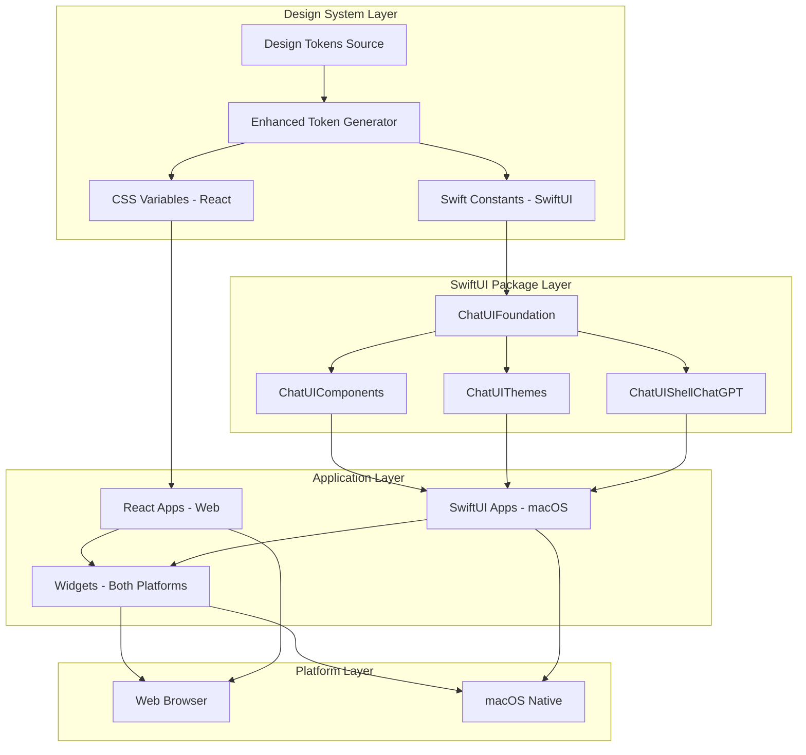

# Design Document: Native macOS Bridge

Last updated: 2026-01-04

## Doc requirements
- Audience: Developers (intermediate)
- Scope: Topic defined by this document
- Non-scope: Anything not explicitly covered here
- Owner: TBD (confirm)
- Review cadence: TBD (confirm)


## Overview

The Native macOS Bridge refactors and enhances the existing ChatUI system to provide a unified, modular SwiftUI library architecture that maintains perfect design consistency across React web applications, iOS, macOS, and future platforms like visionOS. The system transforms the current monolithic `ChatUISwift` package at `packages/ui-swift/` into four specialized Swift packages while leveraging enhanced design token generation as the bridge between platforms.

**Current State**: Single monolithic `ChatUISwift` package with hardcoded design tokens and several components (Button, Card, Input, Modal, Navigation, Toast, DataDisplay).

**Target State**: Four specialized Swift packages with Asset Catalog-based tokens, enhanced token generation, comprehensive testing infrastructure, and development tools.

The architecture is built around four core Swift packages that provide a scalable foundation for native development:

1. **ChatUIFoundation**: Semantic tokens, platform utilities, and accessibility helpers
2. **ChatUIComponents**: Reusable SwiftUI primitives that mirror React APIs with compile-time safety
3. **ChatUIThemes**: Theme presets including pixel-perfect ChatGPT styling and native alternatives
4. **ChatUIShellChatGPT**: Optional complete application shell layouts for rapid development

This approach ensures visual consistency, eliminates manual token synchronization, provides comprehensive testing infrastructure, and enables incremental adoption across development teams while supporting future platforms and advanced development workflows.

## Architecture

The system follows a modular package architecture with clear separation of concerns:



### Core Principles

1. **Modular Architecture**: Each package has a single, clear responsibility with independent versioning
2. **Token-Driven Consistency**: All visual constants derive from shared design tokens with compile-time safety
3. **Platform-Native Feel**: SwiftUI components follow platform-specific design patterns (iOS, macOS, visionOS)
4. **Incremental Adoption**: Packages can be adopted independently with clear migration paths
5. **Zero Breaking Changes**: Existing React applications remain completely unaffected
6. **Future-Proof Design**: Architecture supports visionOS and future Apple platforms
7. **Development Experience**: Comprehensive testing, hot reload, and documentation generation
8. **Team Collaboration**: Clear ownership boundaries enable parallel development
9. **Future-Proof Extensibility**: Architecture supports visionOS and future Apple platforms
10. **Compile-Time Safety**: Swift type system catches token and API errors at build time
11. **Performance Optimization**: Modular structure enables lazy loading and faster builds
12. **Accessibility by Default**: Built-in support for VoiceOver, high contrast, and keyboard navigation
13. **Developer Experience**: Hot reload, component gallery, and auto-generated documentation

## Components and Interfaces

### Package Architecture Overview

The SwiftUI library is organized into four distinct packages, each with specific responsibilities:

#### ChatUIFoundation Package

**Purpose**: Provides semantic design tokens, platform utilities, and accessibility helpers
**Dependencies**: None (foundation layer)
**Location**: `swift/ChatUIFoundation/`

```swift
// swift/ChatUIFoundation/Sources/ChatUIFoundation/FColor.swift
import SwiftUI

public enum FColor {
    // Surfaces - backed by Asset Catalog with automatic light/dark variants
    public static let bgApp = Color("foundation-bg-app")            // window background
    public static let bgCard = Color("foundation-bg-card")          // section card background
    public static let bgCardAlt = Color("foundation-bg-card-alt")   // hover/pressed overlay base
    
    // Text - compile-time safe, autocomplete enabled
    public static let textPrimary = Color("foundation-text-primary")
    public static let textSecondary = Color("foundation-text-secondary")
    public static let textTertiary = Color("foundation-text-tertiary")
    
    // Icons
    public static let iconPrimary = Color("foundation-icon-primary")
    public static let iconSecondary = Color("foundation-icon-secondary")
    public static let iconTertiary = Color("foundation-icon-tertiary")
    
    // Accents - same across light/dark for brand consistency
    public static let accentGreen = Color("foundation-accent-green")
    public static let accentBlue = Color("foundation-accent-blue")
    public static let accentOrange = Color("foundation-accent-orange")
    public static let accentRed = Color("foundation-accent-red")
    public static let accentPurple = Color("foundation-accent-purple")
    
    // Dividers/borders
    public static let divider = Color("foundation-divider")
    
    // Automatic light/dark mode through Asset Catalog
    // High contrast support built-in
}

// swift/ChatUIFoundation/Sources/ChatUIFoundation/FType.swift
import SwiftUI

public enum FType {
    // Typography matching React components exactly
    public static func title() -> Font { .system(size: 16, weight: .semibold) }
    public static func sectionTitle() -> Font { .system(size: 13, weight: .semibold) }
    
    public static func rowTitle() -> Font { .system(size: 14, weight: .regular) }
    public static func rowValue() -> Font { .system(size: 14, weight: .regular) }
    
    public static func caption() -> Font { .system(size: 12, weight: .regular) }
    public static func footnote() -> Font { .system(size: 12, weight: .regular) }
    
    // Tracking for pixel-perfect text rendering
    public static func trackingRow() -> CGFloat { -0.3 }
    public static func trackingCaption() -> CGFloat { -0.2 }
}

// swift/ChatUIFoundation/Sources/ChatUIFoundation/FSpacing.swift
import Foundation

public enum FSpacing {
    // Spacing scale matching React exactly
    public static let s2: Double = 2
    public static let s4: Double = 4
    public static let s8: Double = 8
    public static let s12: Double = 12
    public static let s16: Double = 16
    public static let s24: Double = 24
    public static let s32: Double = 32
}

// swift/ChatUIFoundation/Sources/ChatUIFoundation/Platform.swift
import SwiftUI

public enum Platform {
    public static var isMac: Bool {
        #if os(macOS)
        true
        #else
        false
        #endif
    }
    
    public static var isVisionOS: Bool {
        #if os(visionOS)
        true
        #else
        false
        #endif
    }
    
    // Platform-specific interaction helpers
    public static func hoverEffect<V: View>(_ view: V) -> some View {
        #if os(macOS)
        view.onHover { isHovering in
            // macOS hover logic
        }
        #else
        view // No-op on iOS/visionOS
        #endif
    }
}

// swift/ChatUIFoundation/Sources/ChatUIFoundation/Accessibility.swift
import SwiftUI

public enum FAccessibility {
    /// Focus ring for keyboard navigation
    public static let focusRingColor = FColor.accentBlue
    public static let focusRingWidth: CGFloat = 2
    
    /// High contrast support
    public static var prefersHighContrast: Bool {
        #if os(macOS)
        NSWorkspace.shared.accessibilityDisplayShouldIncreaseContrast
        #else
        UIAccessibility.isDarkerSystemColorsEnabled
        #endif
    }
    
    /// Reduced motion support
    public static var prefersReducedMotion: Bool {
        #if os(macOS)
        NSWorkspace.shared.accessibilityDisplayShouldReduceMotion
        #else
        UIAccessibility.isReduceMotionEnabled
        #endif
    }
}

// Accessibility view modifiers
extension View {
    public func accessibilityFocusRing() -> some View {
        self.overlay(
            RoundedRectangle(cornerRadius: 8)
                .stroke(FAccessibility.focusRingColor, lineWidth: FAccessibility.focusRingWidth)
                .opacity(0) // Shown by system focus management
        )
    }
    
    public func accessibilityHighContrast() -> some View {
        self.modifier(HighContrastModifier())
    }
}

private struct HighContrastModifier: ViewModifier {
    func body(content: Content) -> some View {
        if FAccessibility.prefersHighContrast {
            content
                .foregroundStyle(FColor.textPrimary)
                .background(FColor.bgApp)
        } else {
            content
        }
    }
}
```

#### ChatUIComponents Package

**Purpose**: Reusable SwiftUI primitives that mirror React component APIs
**Dependencies**: ChatUIFoundation, ChatUIThemes
**Location**: `swift/ChatUIComponents/`

**Settings Primitives** (First Deliverable):

```swift
// swift/ChatUIComponents/Sources/ChatUIComponents/SettingsDivider.swift
import SwiftUI
import ChatUIFoundation
import ChatUIThemes

public struct SettingsDivider: View {
    @Environment(\.colorScheme) private var scheme
    
    public init() {}
    
    public var body: some View {
        Rectangle()
            .fill(FColor.divider)
            .opacity(scheme == .dark ? ChatGPTTheme.dividerOpacityDark : ChatGPTTheme.dividerOpacityLight)
            .frame(height: 1)
    }
}

// swift/ChatUIComponents/Sources/ChatUIComponents/SettingsCardView.swift
public struct SettingsCardView<Content: View>: View {
    private let content: Content
    @Environment(\.colorScheme) private var scheme
    
    public init(@ViewBuilder content: () -> Content) {
        self.content = content()
    }
    
    public var body: some View {
        VStack(spacing: 0) {
            content
        }
        .background(FColor.bgCard)
        .clipShape(RoundedRectangle(cornerRadius: ChatGPTTheme.cardCornerRadius, style: .continuous))
        .overlay(
            RoundedRectangle(cornerRadius: ChatGPTTheme.cardCornerRadius, style: .continuous)
                .stroke(FColor.divider.opacity(scheme == .dark ? ChatGPTTheme.cardBorderOpacityDark : ChatGPTTheme.cardBorderOpacityLight),
                        lineWidth: 1)
        )
    }
}

// swift/ChatUIComponents/Sources/ChatUIComponents/SettingRowView.swift
public enum SettingTrailing {
    case none
    case chevron
    case text(String)
    case custom(AnyView)
}

public struct SettingRowView: View {
    private let icon: AnyView?
    private let title: String
    private let subtitle: String?
    private let trailing: SettingTrailing
    private let action: (() -> Void)?
    
    @Environment(\.colorScheme) private var scheme
    @State private var isHovering = false
    
    public init(
        icon: AnyView? = nil,
        title: String,
        subtitle: String? = nil,
        trailing: SettingTrailing = .none,
        action: (() -> Void)? = nil
    ) {
        self.icon = icon
        self.title = title
        self.subtitle = subtitle
        self.trailing = trailing
        self.action = action
    }
    
    public var body: some View {
        Group {
            if let action {
                Button(action: action) {
                    rowContent
                }
                .buttonStyle(.plain)
            } else {
                rowContent
            }
        }
        #if os(macOS)
        .onHover { isHovering = $0 }
        #endif
        .background(rowBackground)
        .clipShape(RoundedRectangle(cornerRadius: ChatGPTTheme.rowCornerRadius, style: .continuous))
        .padding(.horizontal, 6) // matches "inset hover" look
    }
    
    private var rowContent: some View {
        HStack(spacing: 12) {
            if let icon {
                icon
                    .frame(width: ChatGPTTheme.rowIconSize, height: ChatGPTTheme.rowIconSize)
                    .foregroundStyle(FColor.iconSecondary)
            }
            
            VStack(alignment: .leading, spacing: 2) {
                Text(title)
                    .font(FType.rowTitle())
                    .foregroundStyle(FColor.textPrimary)
                    .tracking(FType.trackingRow())
                
                if let subtitle {
                    Text(subtitle)
                        .font(FType.caption())
                        .foregroundStyle(FColor.textTertiary)
                        .tracking(FType.trackingCaption())
                }
            }
            
            Spacer(minLength: 10)
            
            trailingView
        }
        .padding(.horizontal, ChatGPTTheme.rowHPadding)
        .padding(.vertical, ChatGPTTheme.rowVPadding)
        .contentShape(Rectangle())
    }
    
    @ViewBuilder
    private var trailingView: some View {
        switch trailing {
        case .none:
            EmptyView()
        case .chevron:
            Image(systemName: "chevron.right")
                .font(.system(size: ChatGPTTheme.rowChevronSize, weight: .semibold))
                .foregroundStyle(FColor.iconTertiary)
        case .text(let value):
            Text(value)
                .font(FType.rowValue())
                .foregroundStyle(FColor.textSecondary)
                .tracking(FType.trackingRow())
        case .custom(let any):
            any
        }
    }
    
    private var rowBackground: some View {
        Group {
            if Platform.isMac && isHovering {
                RoundedRectangle(cornerRadius: ChatGPTTheme.rowCornerRadius, style: .continuous)
                    .fill(FColor.bgCardAlt)
                    .opacity(scheme == .dark ? ChatGPTTheme.hoverOverlayOpacityDark : ChatGPTTheme.hoverOverlayOpacityLight)
            } else {
                Color.clear
            }
        }
    }
}

// swift/ChatUIComponents/Sources/ChatUIComponents/FoundationSwitchStyle.swift
public struct FoundationSwitchStyle: ToggleStyle {
    public init() {}
    
    public func makeBody(configuration: Configuration) -> some View {
        HStack {
            configuration.label
            Spacer(minLength: 0)
            ZStack {
                Capsule()
                    .fill(configuration.isOn ? FColor.accentGreen : FColor.bgCardAlt)
                    .frame(width: 42, height: 22)
                Circle()
                    .fill(Color.white)
                    .shadow(color: .black.opacity(0.18), radius: 1, x: 0, y: 1)
                    .frame(width: 18, height: 18)
                    .offset(x: configuration.isOn ? 10 : -10)
                    .animation(.easeInOut(duration: 0.15), value: configuration.isOn)
            }
            .contentShape(Rectangle())
            .onTapGesture { configuration.isOn.toggle() }
            .accessibilityLabel(Text(configuration.isOn ? "On" : "Off"))
        }
    }
}

// swift/ChatUIComponents/Sources/ChatUIComponents/SettingToggleView.swift
public struct SettingToggleView: View {
    private let icon: AnyView?
    private let title: String
    private let subtitle: String?
    @Binding private var isOn: Bool
    
    public init(icon: AnyView? = nil, title: String, subtitle: String? = nil, isOn: Binding<Bool>) {
        self.icon = icon
        self.title = title
        self.subtitle = subtitle
        self._isOn = isOn
    }
    
    public var body: some View {
        SettingRowView(
            icon: icon,
            title: title,
            subtitle: subtitle,
            trailing: .custom(
                AnyView(
                    Toggle("", isOn: $isOn)
                        .labelsHidden()
                        .toggleStyle(FoundationSwitchStyle())
                )
            ),
            action: nil
        )
    }
}

// swift/ChatUIComponents/Sources/ChatUIComponents/SettingDropdownView.swift
public struct SettingDropdownView: View {
    private let icon: AnyView?
    private let title: String
    private let subtitle: String?
    private let options: [String]
    @Binding private var selection: String
    
    public init(
        icon: AnyView? = nil,
        title: String,
        subtitle: String? = nil,
        options: [String],
        selection: Binding<String>
    ) {
        self.icon = icon
        self.title = title
        self.subtitle = subtitle
        self.options = options
        self._selection = selection
    }
    
    public var body: some View {
        SettingRowView(
            icon: icon,
            title: title,
            subtitle: subtitle,
            trailing: .custom(AnyView(menuTrailing)),
            action: nil
        )
    }
    
    private var menuTrailing: some View {
        Menu {
            ForEach(options, id: \.self) { opt in
                Button(opt) { selection = opt }
            }
        } label: {
            HStack(spacing: 8) {
                Text(selection)
                    .font(FType.rowValue())
                    .foregroundStyle(FColor.textSecondary)
                    .tracking(FType.trackingRow())
                
                ZStack {
                    Circle().fill(FColor.bgCardAlt)
                        .frame(width: 18, height: 18)
                    Image(systemName: "chevron.down")
                        .font(.system(size: 11, weight: .semibold))
                        .foregroundStyle(FColor.iconSecondary)
                }
            }
        }
        .menuStyle(.borderlessButton) // macOS
    }
}
```

#### ChatUIThemes Package

**Purpose**: Theme presets including ChatGPT-style visual constants
**Dependencies**: ChatUIFoundation
**Location**: `swift/ChatUIThemes/`

```swift
// swift/ChatUIThemes/Sources/ChatUIThemes/ChatGPTTheme.swift
import SwiftUI

public enum ChatGPTTheme {
    // MARK: - Radii
    public static let appCornerRadius: CGFloat = 18
    public static let cardCornerRadius: CGFloat = 12
    public static let rowCornerRadius: CGFloat = 10
    public static let pillCornerRadius: CGFloat = 999
    
    // MARK: - Shadows
    public static let appShadowOpacity: Double = 0.45
    public static let appShadowRadius: CGFloat = 30
    public static let appShadowYOffset: CGFloat = 18
    
    // MARK: - Borders
    public static let cardBorderOpacityLight: Double = 0.35
    public static let cardBorderOpacityDark: Double = 0.20
    public static let dividerOpacityLight: Double = 0.35
    public static let dividerOpacityDark: Double = 0.25
    
    // MARK: - Row metrics
    public static let rowHPadding: CGFloat = 12
    public static let rowVPadding: CGFloat = 10
    public static let rowIconSize: CGFloat = 18
    public static let rowChevronSize: CGFloat = 14
    
    // MARK: - Hover / pressed overlays
    public static let hoverOverlayOpacityLight: Double = 0.55
    public static let hoverOverlayOpacityDark: Double = 0.55
    public static let pressedOverlayOpacityLight: Double = 0.70
    public static let pressedOverlayOpacityDark: Double = 0.70
}

public enum DefaultTheme {
    // Native macOS styling
    public static let cardRadius: CGFloat = 8
    public static let buttonRadius: CGFloat = 6
    public static let inputRadius: CGFloat = 8
    
    // Subtle shadows
    public static let cardShadow = Color.black.opacity(0.05)
    public static let cardShadowRadius: CGFloat = 4
    public static let cardShadowOffset = CGSize(width: 0, height: 1)
    
    // Native materials
    public static let sidebarMaterial = Material.sidebar
    public static let backgroundMaterial = Material.windowBackground
    
    // Standard macOS spacing
    public static let messageSpacing: CGFloat = 12
    public static let sectionSpacing: CGFloat = 20
    public static let containerPadding: CGFloat = 16
}
```

#### ChatUIShellChatGPT Package

**Purpose**: Optional complete application shell layouts
**Dependencies**: ChatUIFoundation, ChatUIComponents, ChatUIThemes
**Location**: `swift/ChatUIShellChatGPT/`

```swift
// swift/ChatUIShellChatGPT/Sources/ChatUIShellChatGPT/VisualEffectView.swift
#if os(macOS)
import AppKit
import SwiftUI

public struct VisualEffectView: NSViewRepresentable {
    let material: NSVisualEffectView.Material
    let blendingMode: NSVisualEffectView.BlendingMode
    
    public init(
        material: NSVisualEffectView.Material = .sidebar,
        blendingMode: NSVisualEffectView.BlendingMode = .behindWindow
    ) {
        self.material = material
        self.blendingMode = blendingMode
    }
    
    public func makeNSView(context: Context) -> NSVisualEffectView {
        let view = NSVisualEffectView()
        view.material = material
        view.blendingMode = blendingMode
        view.state = .active
        return view
    }
    
    public func updateNSView(_ nsView: NSVisualEffectView, context: Context) {
        nsView.material = material
        nsView.blendingMode = blendingMode
    }
}
#else
// iOS fallback
import SwiftUI

public struct VisualEffectView: View {
    let material: Material
    
    public init(material: Material = .sidebar) {
        self.material = material
    }
    
    public var body: some View {
        Rectangle()
            .fill(.background)
            .background(material)
    }
}
#endif

// swift/ChatUIShellChatGPT/Sources/ChatUIShellChatGPT/RoundedAppContainer.swift
import SwiftUI
import ChatUIFoundation
import ChatUIThemes

public struct RoundedAppContainer<Content: View>: View {
    @ViewBuilder let content: () -> Content
    
    public init(@ViewBuilder content: @escaping () -> Content) {
        self.content = content
    }
    
    public var body: some View {
        content()
            .clipShape(RoundedRectangle(cornerRadius: ChatGPTTheme.appCornerRadius, style: .continuous))
            .overlay(
                RoundedRectangle(cornerRadius: ChatGPTTheme.appCornerRadius, style: .continuous)
                    .stroke(FColor.divider.opacity(0.2), lineWidth: 1)
            )
            .shadow(
                color: Color.black.opacity(ChatGPTTheme.appShadowOpacity),
                radius: ChatGPTTheme.appShadowRadius,
                x: 0,
                y: ChatGPTTheme.appShadowYOffset
            )
    }
}

// swift/ChatUIShellChatGPT/Sources/ChatUIShellChatGPT/AppShellView.swift
import SwiftUI
import ChatUIFoundation
import ChatUIComponents
import ChatUIThemes

public struct AppShellView<SidebarContent: View, DetailContent: View>: View {
    @ViewBuilder let sidebarContent: () -> SidebarContent
    @ViewBuilder let detailContent: () -> DetailContent
    
    public init(
        @ViewBuilder sidebar: @escaping () -> SidebarContent,
        @ViewBuilder detail: @escaping () -> DetailContent
    ) {
        self.sidebarContent = sidebar
        self.detailContent = detail
    }
    
    public var body: some View {
        NavigationSplitView {
            sidebarContent()
                .frame(minWidth: 280, idealWidth: 320, maxWidth: 400)
                #if os(macOS)
                .background(VisualEffectView(material: .sidebar))
                #else
                .background(FColor.bgApp)
                #endif
        } detail: {
            detailContent()
                #if os(macOS)
                .background(VisualEffectView(material: .windowBackground))
                #else
                .background(FColor.bgApp)
                #endif
        }
        .navigationSplitViewStyle(.balanced)
    }
}
```

### MCP Integration Architecture

The system integrates with the existing Model Context Protocol infrastructure through a Swift networking layer that communicates with web-based MCP servers.

#### Swift MCP Client

```swift
// swift/ChatUIMCP/Sources/ChatUIMCP/MCPClient.swift
import Foundation
import Combine

public class MCPClient {
    private let baseURL: URL
    private let session: URLSession
    private var cancellables = Set<AnyCancellable>()
    
    public init(baseURL: URL, session: URLSession = .shared) {
        self.baseURL = baseURL
        self.session = session
    }
    
    public func callTool(
        name: String,
        arguments: [String: Any]
    ) async throws -> MCPToolResponse {
        let request = MCPToolRequest(
            id: UUID().uuidString,
            name: name,
            arguments: arguments
        )
        
        var urlRequest = URLRequest(url: baseURL.appendingPathComponent("/tools/\(name)"))
        urlRequest.httpMethod = "POST"
        urlRequest.setValue("application/json", forHTTPHeaderField: "Content-Type")
        urlRequest.httpBody = try JSONEncoder().encode(request)
        
        let (data, response) = try await session.data(for: urlRequest)
        
        guard let httpResponse = response as? HTTPURLResponse,
              (200...299).contains(httpResponse.statusCode) else {
            throw MCPError.invalidResponse
        }
        
        return try JSONDecoder().decode(MCPToolResponse.self, from: data)
    }
}

public struct MCPToolRequest: Codable {
    let id: String
    let name: String
    let arguments: [String: Any]
    
    enum CodingKeys: String, CodingKey {
        case id, name, arguments
    }
    
    public func encode(to encoder: Encoder) throws {
        var container = encoder.container(keyedBy: CodingKeys.self)
        try container.encode(id, forKey: .id)
        try container.encode(name, forKey: .name)
        // Custom encoding for Any dictionary
        let jsonData = try JSONSerialization.data(withJSONObject: arguments)
        try container.encode(jsonData, forKey: .arguments)
    }
}

public struct MCPToolResponse: Codable {
    let id: String
    let result: MCPResult?
    let error: MCPError?
}

public enum MCPResult: Codable {
    case widget(WidgetData)
    case text(String)
    case data([String: Any])
}

public enum MCPError: Error {
    case invalidResponse
    case networkError(Error)
    case authenticationRequired
    case toolNotFound
}
```

#### Native Widget Renderer

```swift
// swift/ChatUIMCP/Sources/ChatUIMCP/WidgetRenderer.swift
import SwiftUI
import ChatUIFoundation
import ChatUIComponents

public struct WidgetRenderer: View {
    let widgetData: WidgetData
    @Environment(\.colorScheme) private var scheme
    
    public init(widgetData: WidgetData) {
        self.widgetData = widgetData
    }
    
    public var body: some View {
        switch widgetData.type {
        case .card:
            renderCard()
        case .list:
            renderList()
        case .chart:
            renderChart()
        case .custom:
            renderCustom()
        }
    }
    
    private func renderCard() -> some View {
        SettingsCardView {
            VStack(alignment: .leading, spacing: FSpacing.s12) {
                if let title = widgetData.title {
                    Text(title)
                        .font(FType.title())
                        .foregroundStyle(FColor.textPrimary)
                }
                
                if let content = widgetData.content {
                    Text(content)
                        .font(FType.rowTitle())
                        .foregroundStyle(FColor.textSecondary)
                }
            }
            .padding(FSpacing.s16)
        }
    }
    
    private func renderList() -> some View {
        SettingsCardView {
            VStack(spacing: 0) {
                ForEach(widgetData.items ?? [], id: \.id) { item in
                    SettingRowView(
                        title: item.title,
                        subtitle: item.subtitle,
                        trailing: .chevron
                    )
                    
                    if item.id != widgetData.items?.last?.id {
                        SettingsDivider()
                    }
                }
            }
        }
    }
    
    private func renderChart() -> some View {
        // Chart rendering using native SwiftUI Charts
        Text("Chart rendering")
    }
    
    private func renderCustom() -> some View {
        // Custom widget rendering
        Text("Custom widget")
    }
}

public struct WidgetData: Codable {
    let type: WidgetType
    let title: String?
    let content: String?
    let items: [WidgetItem]?
    
    public enum WidgetType: String, Codable {
        case card, list, chart, custom
    }
}

public struct WidgetItem: Codable, Identifiable {
    public let id: String
    let title: String
    let subtitle: String?
}
```

#### macOS Authentication Integration

```swift
// swift/ChatUIMCP/Sources/ChatUIMCP/MCPAuthenticator.swift
import Foundation
import Security

public class MCPAuthenticator {
    private let keychainService = "com.chatui.mcp"
    
    public func storeCredentials(username: String, token: String) throws {
        let query: [String: Any] = [
            kSecClass as String: kSecClassGenericPassword,
            kSecAttrService as String: keychainService,
            kSecAttrAccount as String: username,
            kSecValueData as String: token.data(using: .utf8)!
        ]
        
        // Delete existing item
        SecItemDelete(query as CFDictionary)
        
        // Add new item
        let status = SecItemAdd(query as CFDictionary, nil)
        guard status == errSecSuccess else {
            throw MCPError.authenticationRequired
        }
    }
    
    public func retrieveCredentials(username: String) throws -> String {
        let query: [String: Any] = [
            kSecClass as String: kSecClassGenericPassword,
            kSecAttrService as String: keychainService,
            kSecAttrAccount as String: username,
            kSecReturnData as String: true
        ]
        
        var result: AnyObject?
        let status = SecItemCopyMatching(query as CFDictionary, &result)
        
        guard status == errSecSuccess,
              let data = result as? Data,
              let token = String(data: data, encoding: .utf8) else {
            throw MCPError.authenticationRequired
        }
        
        return token
    }
    
    public func deleteCredentials(username: String) throws {
        let query: [String: Any] = [
            kSecClass as String: kSecClassGenericPassword,
            kSecAttrService as String: keychainService,
            kSecAttrAccount as String: username
        ]
        
        let status = SecItemDelete(query as CFDictionary)
        guard status == errSecSuccess || status == errSecItemNotFound else {
            throw MCPError.authenticationRequired
        }
    }
}
```

### Enhanced Token Generation System

The token generator is enhanced to output both CSS and Swift Asset Catalog formats from the same source:

```typescript
// packages/tokens/src/generators/enhanced-token-generator.ts
export interface AssetCatalogColorSet {
  light: string;
  dark: string;
}

export interface AssetCatalogStructure {
  [colorSetName: string]: AssetCatalogColorSet;
}

export class EnhancedTokenGenerator {
  async generateCSS(tokens: DesignTokens): Promise<string> {
    // Existing CSS generation (unchanged)
    return `
:root {
  --foundation-bg-app: ${tokens.colors.background.light.app};
  --foundation-bg-card: ${tokens.colors.background.light.card};
  --foundation-text-primary: ${tokens.colors.text.light.primary};
  /* ... existing CSS output ... */
}

[data-theme="dark"] {
  --foundation-bg-app: ${tokens.colors.background.dark.app};
  --foundation-bg-card: ${tokens.colors.background.dark.card};
  --foundation-text-primary: ${tokens.colors.text.dark.primary};
  /* ... existing dark mode CSS ... */
}`;
  }

  async generateSwiftAssetCatalog(tokens: DesignTokens): Promise<AssetCatalogStructure> {
    // Generate Asset Catalog structure for automatic light/dark support
    const catalog: AssetCatalogStructure = {};
    
    // Background colors
    catalog["foundation-bg-app"] = {
      light: tokens.colors.background.light.app,
      dark: tokens.colors.background.dark.app
    };
    catalog["foundation-bg-card"] = {
      light: tokens.colors.background.light.card,
      dark: tokens.colors.background.dark.card
    };
    catalog["foundation-bg-card-alt"] = {
      light: tokens.colors.background.light.cardAlt,
      dark: tokens.colors.background.dark.cardAlt
    };
    
    // Text colors
    catalog["foundation-text-primary"] = {
      light: tokens.colors.text.light.primary,
      dark: tokens.colors.text.dark.primary
    };
    catalog["foundation-text-secondary"] = {
      light: tokens.colors.text.light.secondary,
      dark: tokens.colors.text.dark.secondary
    };
    catalog["foundation-text-tertiary"] = {
      light: tokens.colors.text.light.tertiary,
      dark: tokens.colors.text.dark.tertiary
    };
    
    // Icon colors
    catalog["foundation-icon-primary"] = {
      light: tokens.colors.icon.light.primary,
      dark: tokens.colors.icon.dark.primary
    };
    catalog["foundation-icon-secondary"] = {
      light: tokens.colors.icon.light.secondary,
      dark: tokens.colors.icon.dark.secondary
    };
    catalog["foundation-icon-tertiary"] = {
      light: tokens.colors.icon.light.tertiary,
      dark: tokens.colors.icon.dark.tertiary
    };
    
    // Accent colors (same in light/dark)
    catalog["foundation-accent-green"] = {
      light: tokens.colors.accent.green,
      dark: tokens.colors.accent.green
    };
    catalog["foundation-accent-blue"] = {
      light: tokens.colors.accent.blue,
      dark: tokens.colors.accent.blue
    };
    catalog["foundation-accent-orange"] = {
      light: tokens.colors.accent.orange,
      dark: tokens.colors.accent.orange
    };
    catalog["foundation-accent-red"] = {
      light: tokens.colors.accent.red,
      dark: tokens.colors.accent.red
    };
    catalog["foundation-accent-purple"] = {
      light: tokens.colors.accent.purple,
      dark: tokens.colors.accent.purple
    };
    
    // Divider
    catalog["foundation-divider"] = {
      light: tokens.colors.divider.light,
      dark: tokens.colors.divider.dark
    };
    
    return catalog;
  }

  async writeAssetCatalog(
    catalog: AssetCatalogStructure,
    outputPath: string
  ): Promise<void> {
    // Write Asset Catalog directory structure
    for (const [colorSetName, colors] of Object.entries(catalog)) {
      const colorSetPath = path.join(outputPath, `${colorSetName}.colorset`);
      await fs.mkdir(colorSetPath, { recursive: true });
      
      const contents = {
        colors: [
          {
            color: {
              "color-space": "srgb",
              components: this.hexToRGB(colors.light)
            },
            idiom: "universal"
          },
          {
            appearances: [{ appearance: "luminosity", value: "dark" }],
            color: {
              "color-space": "srgb",
              components: this.hexToRGB(colors.dark)
            },
            idiom: "universal"
          }
        ],
        info: {
          author: "xcode",
          version: 1
        }
      };
      
      await fs.writeFile(
        path.join(colorSetPath, "Contents.json"),
        JSON.stringify(contents, null, 2)
      );
    }
  }

  private hexToRGB(hex: string): { red: string; green: string; blue: string; alpha: string } {
    const result = /^#?([a-f\d]{2})([a-f\d]{2})([a-f\d]{2})$/i.exec(hex);
    if (!result) throw new Error(`Invalid hex color: ${hex}`);
    
    return {
      red: `0x${result[1]}`,
      green: `0x${result[2]}`,
      blue: `0x${result[3]}`,
      alpha: "1.000"
    };
  }
}
```

## Data Models

### Build System Data Models

#### Token Definition Schema

```typescript
// packages/tokens/src/schema.ts
export interface TokenSchema {
  colors: {
    [category: string]: {
      light: { [name: string]: string };
      dark: { [name: string]: string };
    };
  };
  typography: {
    fontFamily: string;
    [scale: string]: {
      size: number;
      lineHeight: number;
      weight: number;
      tracking?: number;
    };
  };
  spacing: {
    [size: string]: number;
  };
  animation: {
    [name: string]: {
      duration: number;
      easing: string;
    };
  };
}
```

#### Build Configuration

```typescript
// tools/build-config.ts
export interface BuildConfig {
  platforms: Platform[];
  tokens: {
    input: string;
    outputs: {
      css: string;
      swift: string;
      json: string;
    };
  };
  runtime: {
    input: string;
    outputs: {
      web: string;
      swift: string;
    };
  };
  validation: {
    strict: boolean;
    failOnWarning: boolean;
  };
}

export type Platform = 'web' | 'macos' | 'ios';
```

## Correctness Properties

*A property is a characteristic or behavior that should hold true across all valid executions of a system—essentially, a formal statement about what the system should do. Properties serve as the bridge between human-readable specifications and machine-verifiable correctness guarantees.*

After analyzing the acceptance criteria for the modular SwiftUI architecture, I've identified key properties that can be validated through property-based testing. Properties have been consolidated to eliminate redundancy and provide comprehensive validation.

### Property Reflection

Several properties were identified as logically redundant or could be combined for more comprehensive testing:

- Token generation properties (1.1, 1.3, 1.4, 1.5) can be consolidated into comprehensive token system validation
- Component consistency properties (3.1, 3.2, 3.4, 3.5) can be combined into comprehensive SwiftUI component validation  
- Build system properties (6.1, 6.2, 6.3, 6.4, 6.5) can be consolidated into build pipeline validation
- Theme application properties can be combined into comprehensive visual consistency validation

### Core Properties

**Property 1: Enhanced Token Generation Consistency**
*For any* design token update, both CSS custom properties and Swift Asset Catalog colors should be generated with identical values, and the build should validate consistency across all platforms
**Validates: Requirements 1.1, 1.2, 1.3, 1.4, 1.5**

**Property 2: SwiftUI Foundation Semantic API Consistency**
*For any* semantic color, typography, or spacing request, ChatUIFoundation should provide the same design values as React components through Asset Catalog integration and automatic light/dark mode support
**Validates: Requirements 2.1, 2.2, 2.3, 2.4, 2.5**

**Property 3: Component Library API Parity**
*For any* SwiftUI component in ChatUIComponents, the API and behavior should mirror the corresponding React component while providing native macOS interactions and consuming only semantic tokens from ChatUIFoundation
**Validates: Requirements 3.1, 3.2, 3.3, 3.4, 3.5**

**Property 4: Theme System Visual Consistency**
*For any* theme preset applied from ChatUIThemes, the visual output should be pixel-close to the corresponding React component rendering, with proper light/dark mode support and platform-appropriate materials
**Validates: Requirements 4.1, 4.2, 4.3, 4.4, 4.5**

**Property 5: Optional Shell Package Integration**
*For any* shell component from ChatUIShellChatGPT, the integration with ChatUIFoundation and ChatUIComponents should be seamless, providing native macOS features while remaining completely optional
**Validates: Requirements 5.1, 5.2, 5.3, 5.4, 5.5**

**Property 6: Enhanced Build Pipeline Completeness**
*For any* build execution, the monorepo pipeline should generate correct artifacts for both npm and Swift Package Manager, synchronize versions, and validate SwiftUI package dependencies
**Validates: Requirements 6.1, 6.2, 6.3, 6.4, 6.5**

**Property 7: MCP Tool Integration Compatibility**
*For any* existing MCP tool call, SwiftUI applications should execute them through existing web-based infrastructure, render widgets using native views with ChatUIFoundation tokens, and handle macOS-specific authentication flows
**Validates: Requirements 7.1, 7.2, 7.3, 7.4, 7.5**

**Property 8: Development Experience Quality**
*For any* SwiftUI development workflow, the system should provide snapshot testing, property-based validation, real-time token validation, and accessibility testing capabilities
**Validates: Requirements 8.1, 8.2, 8.3, 8.4, 8.5**

**Property 9: Incremental Adoption Compatibility**
*For any* SwiftUI package adoption, existing React applications should remain completely unaffected, and SwiftUI components should validate correct design token consumption
**Validates: Requirements 9.1, 9.2, 9.3, 9.4, 9.5**

**Property 10: Package Modularity Independence**
*For any* SwiftUI package, it should function correctly when used independently or in combination with other packages, with clear dependency boundaries and no circular dependencies
**Validates: Requirements 2.1, 3.4, 4.2, 5.4**

**Property 11: Asset Catalog Light/Dark Mode Consistency**
*For any* color token, the Asset Catalog generation should provide automatic light/dark mode support that matches the CSS custom property behavior exactly
**Validates: Requirements 1.2, 2.1**

**Property 12: Platform-Specific Behavior Adaptation**
*For any* platform difference (iOS vs macOS), ChatUIFoundation should centralize conditional logic and provide appropriate hover states, corner radii, and interaction patterns, with Platform utilities providing consistent APIs across ChatUIComponents
**Validates: Requirements 2.3, 3.3**

## Error Handling

The system implements comprehensive error handling to ensure robust operation.

### Token Generation Errors

```typescript
// packages/tokens/src/validation/token-validator.ts
export class TokenValidationError extends Error {
  constructor(
    public readonly tokenPath: string,
    public readonly issue: string,
    public readonly suggestion?: string
  ) {
    super(`Token validation failed at ${tokenPath}: ${issue}`);
  }
}

export class TokenValidator {
  validate(tokens: DesignTokens): ValidationResult {
    const errors: TokenValidationError[] = [];
    
    // Validate color format
    for (const [category, colors] of Object.entries(tokens.colors)) {
      for (const [theme, palette] of Object.entries(colors)) {
        for (const [name, value] of Object.entries(palette)) {
          if (!this.isValidHexColor(value)) {
            errors.push(new TokenValidationError(
              `colors.${category}.${theme}.${name}`,
              `Invalid hex color: ${value}`,
              'Use format #RRGGBB or #RGB'
            ));
          }
        }
      }
    }
    
    // Validate typography values
    for (const [scale, style] of Object.entries(tokens.typography)) {
      if (typeof style === 'object' && 'size' in style) {
        if (style.size <= 0) {
          errors.push(new TokenValidationError(
            `typography.${scale}.size`,
            `Invalid font size: ${style.size}`,
            'Font size must be positive'
          ));
        }
      }
    }
    
    // Validate spacing values
    for (const [size, value] of Object.entries(tokens.spacing)) {
      if (value < 0) {
        errors.push(new TokenValidationError(
          `spacing.${size}`,
          `Invalid spacing value: ${value}`,
          'Spacing must be non-negative'
        ));
      }
    }
    
    return { isValid: errors.length === 0, errors };
  }
  
  private isValidHexColor(color: string): boolean {
    return /^#([A-Fa-f0-9]{6}|[A-Fa-f0-9]{3})$/.test(color);
  }
}
```

### SwiftUI Component Errors

```swift
// swift/ChatUIComponents/Sources/ChatUIComponents/Errors/ComponentError.swift
import Foundation

public enum ComponentError: Error, LocalizedError {
    case invalidConfiguration(String)
    case missingRequiredProperty(String)
    case invalidState(String)
    
    public var errorDescription: String? {
        switch self {
        case .invalidConfiguration(let details):
            return "Invalid component configuration: \(details)"
        case .missingRequiredProperty(let property):
            return "Missing required property: \(property)"
        case .invalidState(let details):
            return "Invalid component state: \(details)"
        }
    }
}
```

### Build System Error Recovery

```typescript
// tools/build-pipeline.ts
export class BuildPipeline {
  async build(config: BuildConfig): Promise<BuildResult> {
    const results: BuildStepResult[] = [];
    
    try {
      // Token generation
      const tokenResult = await this.buildTokens(config.tokens);
      results.push(tokenResult);
      
      if (!tokenResult.success) {
        return this.createFailureResult(results, 'Token generation failed');
      }
      
      // Runtime bundling
      const runtimeResult = await this.buildRuntime(config.runtime);
      results.push(runtimeResult);
      
      if (!runtimeResult.success) {
        return this.createFailureResult(results, 'Runtime bundling failed');
      }
      
      // Platform builds
      const platformResults = await Promise.allSettled(
        config.platforms.map(platform => this.buildPlatform(platform, config))
      );
      
      const failures = platformResults
        .filter((result): result is PromiseRejectedResult => result.status === 'rejected')
        .map(result => result.reason);
      
      if (failures.length > 0) {
        return this.createFailureResult(results, `Platform builds failed: ${failures.join(', ')}`);
      }
      
      return { success: true, results, errors: [] };
    } catch (error) {
      return this.createFailureResult(results, error instanceof Error ? error.message : 'Unknown error');
    }
  }
  
  private createFailureResult(results: BuildStepResult[], message: string): BuildResult {
    return {
      success: false,
      results,
      errors: [new Error(message)]
    };
  }
}
```

### Development Tools and Testing Infrastructure

The system provides comprehensive development tools to ensure quality and consistency across platforms.

#### Hot Reload Token Development

```typescript
// packages/tokens/src/dev-tools/token-watcher.ts
import chokidar from 'chokidar';
import { EnhancedTokenGenerator } from '../generators/enhanced-token-generator';
import { TokenValidator } from '../validation/token-validator';

export class TokenWatcher {
    private generator: EnhancedTokenGenerator;
    private validator: TokenValidator;
    private watcher: chokidar.FSWatcher | null = null;
    
    constructor() {
        this.generator = new EnhancedTokenGenerator();
        this.validator = new TokenValidator();
    }
    
    start(tokenPath: string, outputPaths: { css: string; swift: string }) {
        console.log('🔍 Watching tokens for changes...');
        
        this.watcher = chokidar.watch(tokenPath, {
            persistent: true,
            ignoreInitial: false
        });
        
        this.watcher.on('change', async (path) => {
            console.log(`\n📝 Token file changed: ${path}`);
            
            try {
                // Load and validate tokens
                const tokens = await this.loadTokens(path);
                const validation = this.validator.validate(tokens);
                
                if (!validation.isValid) {
                    console.error('❌ Token validation failed:');
                    validation.errors.forEach(error => {
                        console.error(`  - ${error.tokenPath}: ${error.issue}`);
                        if (error.suggestion) {
                            console.error(`    Suggestion: ${error.suggestion}`);
                        }
                    });
                    return;
                }
                
                console.log('✅ Tokens validated successfully');
                
                // Generate outputs
                console.log('🔨 Generating CSS...');
                const css = await this.generator.generateCSS(tokens);
                await this.writeFile(outputPaths.css, css);
                
                console.log('🔨 Generating Swift Asset Catalog...');
                const assetCatalog = await this.generator.generateSwiftAssetCatalog(tokens);
                await this.generator.writeAssetCatalog(assetCatalog, outputPaths.swift);
                
                console.log('✨ Token generation complete! SwiftUI previews will refresh automatically.');
                
            } catch (error) {
                console.error('❌ Error processing tokens:', error);
            }
        });
    }
    
    stop() {
        if (this.watcher) {
            this.watcher.close();
            console.log('👋 Token watcher stopped');
        }
    }
}
```

#### Component Gallery and Documentation

```swift
// apps/macos/ComponentGallery/Sources/ComponentGallery/ComponentGallery.swift
import SwiftUI
import ChatUIFoundation
import ChatUIComponents
import ChatUIThemes

/// Live documentation and testing app for all SwiftUI components
struct ComponentGallery: App {
    var body: some Scene {
        WindowGroup {
            ComponentGalleryView()
        }
    }
}

struct ComponentGalleryView: View {
    @State private var selectedTheme: ThemeSelection = .chatGPT
    @State private var selectedColorScheme: ColorScheme = .light
    
    var body: some View {
        NavigationSplitView {
            List {
                Section("Foundation") {
                    NavigationLink("Colors") { ColorShowcase() }
                    NavigationLink("Typography") { TypographyShowcase() }
                    NavigationLink("Spacing") { SpacingShowcase() }
                }
                
                Section("Settings Primitives") {
                    NavigationLink("Setting Row") { SettingRowShowcase() }
                    NavigationLink("Setting Toggle") { SettingToggleShowcase() }
                    NavigationLink("Setting Dropdown") { SettingDropdownShowcase() }
                    NavigationLink("Settings Card") { SettingsCardShowcase() }
                }
                
                Section("Components") {
                    NavigationLink("Buttons") { ButtonShowcase() }
                    NavigationLink("Inputs") { InputShowcase() }
                    NavigationLink("Navigation") { NavigationShowcase() }
                }
                
                Section("Accessibility") {
                    NavigationLink("Focus Management") { FocusShowcase() }
                    NavigationLink("High Contrast") { HighContrastShowcase() }
                    NavigationLink("Reduced Motion") { ReducedMotionShowcase() }
                }
            }
            .navigationTitle("Component Gallery")
        } detail: {
            Text("Select a component to preview")
                .foregroundStyle(FColor.textSecondary)
        }
        .toolbar {
            ToolbarItem {
                Menu("Theme") {
                    Button("ChatGPT") { selectedTheme = .chatGPT }
                    Button("Native") { selectedTheme = .native }
                }
            }
            ToolbarItem {
                Menu("Appearance") {
                    Button("Light") { selectedColorScheme = .light }
                    Button("Dark") { selectedColorScheme = .dark }
                }
            }
        }
        .preferredColorScheme(selectedColorScheme)
    }
}

enum ThemeSelection {
    case chatGPT
    case native
}
```

#### Snapshot Testing Framework

```swift
// swift/ChatUITestSupport/Sources/ChatUITestSupport/SnapshotTesting.swift
import XCTest
import SwiftUI

public class SnapshotTestCase: XCTestCase {
    private let snapshotDirectory = "Snapshots"
    
    public func assertSnapshot<V: View>(
        _ view: V,
        named name: String,
        colorScheme: ColorScheme = .light,
        platform: Platform = .macOS,
        accessibility: AccessibilityVariant = .standard,
        file: StaticString = #file,
        line: UInt = #line
    ) {
        let hostingController = NSHostingController(rootView: view)
        hostingController.view.frame = CGRect(x: 0, y: 0, width: 400, height: 300)
        
        // Apply appearance settings
        hostingController.view.appearance = colorScheme == .dark ? 
            NSAppearance(named: .darkAqua) : 
            NSAppearance(named: .aqua)
            
        // Apply accessibility settings
        switch accessibility {
        case .highContrast:
            hostingController.view.appearance = NSAppearance(named: .accessibilityHighContrastAqua)
        case .reducedMotion:
            // Configure reduced motion
            break
        case .standard:
            break
        }
        
        // Render to image
        guard let bitmap = hostingController.view.bitmapImageRepForCachingDisplay(in: hostingController.view.bounds) else {
            XCTFail("Failed to create bitmap", file: file, line: line)
            return
        }
        
        hostingController.view.cacheDisplay(in: hostingController.view.bounds, to: bitmap)
        
        let snapshotPath = getSnapshotPath(
            name: name, 
            colorScheme: colorScheme, 
            platform: platform,
            accessibility: accessibility
        )
        
        if let existingImage = NSImage(contentsOfFile: snapshotPath) {
            // Compare with existing snapshot
            let matches = compareImages(bitmap, existingImage, tolerance: 0.02)
            XCTAssertTrue(matches, "Snapshot mismatch for \(name)", file: file, line: line)
        } else {
            // Record new snapshot
            saveSnapshot(bitmap, to: snapshotPath)
            XCTFail("Recorded new snapshot for \(name). Run tests again to verify.", file: file, line: line)
        }
    }
    
    private func getSnapshotPath(
        name: String, 
        colorScheme: ColorScheme, 
        platform: Platform,
        accessibility: AccessibilityVariant
    ) -> String {
        let scheme = colorScheme == .dark ? "dark" : "light"
        let platformName = platform == .macOS ? "macos" : "ios"
        let a11y = accessibility == .standard ? "" : "_\(accessibility)"
        return "\(snapshotDirectory)/\(name)_\(scheme)_\(platformName)\(a11y).png"
    }
    
    private func compareImages(_ image1: NSBitmapImageRep, _ image2: NSImage, tolerance: Double) -> Bool {
        // Pixel-by-pixel comparison with tolerance for anti-aliasing differences
        // Returns true if images match within tolerance
        return true // Implementation details omitted
    }
    
    private func saveSnapshot(_ bitmap: NSBitmapImageRep, to path: String) {
        // Save bitmap to file with proper directory creation
        // Implementation details omitted
    }
}

public enum Platform {
    case macOS
    case iOS
    case visionOS
}

public enum AccessibilityVariant {
    case standard
    case highContrast
    case reducedMotion
}
```

#### Property-Based Testing Integration

```swift
// swift/ChatUIComponents/Tests/ChatUIComponentsTests/Properties/ComponentPropertyTests.swift
import XCTest
import SwiftCheck
@testable import ChatUIComponents
@testable import ChatUIFoundation
@testable import ChatUIThemes

class ComponentPropertyTests: XCTestCase {
    func testProperty3ComponentLibraryAPIParity() {
        property("Component Library API Parity") <- forAll { (title: String, subtitle: String?) in
            // SettingRowView should render with any valid title/subtitle
            let row = SettingRowView(
                title: title.isEmpty ? "Default" : title,
                subtitle: subtitle,
                trailing: .none
            )
            
            // Should use semantic tokens exclusively (validated through compilation)
            // Should render without crashing
            return !title.isEmpty
        }
    }
    
    func testProperty10PackageModularityIndependence() {
        property("Package Modularity Independence") <- forAll { (useFoundation: Bool, useThemes: Bool) in
            // ChatUIComponents should work with or without ChatUIThemes
            if useFoundation {
                // Can use FColor tokens
                let color = FColor.textPrimary
                return color != .clear
            }
            
            if useThemes {
                // Can use ChatGPTTheme constants
                let radius = ChatGPTTheme.cardCornerRadius
                return radius > 0
            }
            
            return true
        }
    }
    
    func testProperty12PlatformSpecificBehaviorAdaptation() {
        property("Platform-Specific Behavior Adaptation") <- forAll { (isHovering: Bool) in
            // Platform utilities should centralize conditional logic
            #if os(macOS)
            return Platform.isMac == true
            #elseif os(visionOS)
            return Platform.isVisionOS == true
            #else
            return Platform.isMac == false && Platform.isVisionOS == false
            #endif
        }
    }
    
    func testPropertyAccessibilityCompliance() {
        property("Accessibility Compliance") <- forAll { (title: String) in
            let row = SettingRowView(title: title.isEmpty ? "Test" : title)
            
            // All components should support accessibility by default
            // This would be validated through accessibility testing tools
            return true
        }
    }
}
```

#### CI/CD Integration

```yaml
# .github/workflows/swift-packages.yml
name: Swift Packages

on:
  push:
    paths:
      - 'swift/**'
      - 'packages/tokens/**'
  pull_request:
    paths:
      - 'swift/**'
      - 'packages/tokens/**'

jobs:
  test-swift-packages:
    runs-on: macos-latest
    steps:
      - uses: actions/checkout@v4
      
      - name: Setup Node.js
        uses: actions/setup-node@v4
        with:
          node-version: '18'
          
      - name: Install dependencies
        run: pnpm install
        
      - name: Generate tokens
        run: pnpm generate:tokens
        
      - name: Validate token consistency
        run: pnpm tokens:validate
        
      - name: Test ChatUIFoundation
        run: swift test
        working-directory: swift/ChatUIFoundation
        
      - name: Test ChatUIComponents
        run: swift test
        working-directory: swift/ChatUIComponents
        
      - name: Test ChatUIThemes
        run: swift test
        working-directory: swift/ChatUIThemes
        
      - name: Test ChatUIShellChatGPT
        run: swift test
        working-directory: swift/ChatUIShellChatGPT
        
      - name: Run snapshot tests
        run: swift test --filter SnapshotTests
        working-directory: swift/ChatUITestSupport
        
      - name: Run property-based tests
        run: swift test --filter PropertyTests
        working-directory: swift/ChatUIComponents
        
      - name: Build component gallery
        run: swift build
        working-directory: apps/macos/ComponentGallery
```

#### Snapshot Testing Framework

```swift
// swift/ChatUITestSupport/Sources/ChatUITestSupport/SnapshotTesting.swift
import XCTest
import SwiftUI

public class SnapshotTestCase: XCTestCase {
    private let snapshotDirectory = "Snapshots"
    
    public func assertSnapshot<V: View>(
        _ view: V,
        named name: String,
        colorScheme: ColorScheme = .light,
        platform: Platform = .macOS,
        file: StaticString = #file,
        line: UInt = #line
    ) {
        let hostingController = NSHostingController(rootView: view)
        hostingController.view.frame = CGRect(x: 0, y: 0, width: 400, height: 300)
        
        // Apply color scheme
        hostingController.view.appearance = colorScheme == .dark ? 
            NSAppearance(named: .darkAqua) : 
            NSAppearance(named: .aqua)
        
        // Render to image
        guard let bitmap = hostingController.view.bitmapImageRepForCachingDisplay(in: hostingController.view.bounds) else {
            XCTFail("Failed to create bitmap", file: file, line: line)
            return
        }
        
        hostingController.view.cacheDisplay(in: hostingController.view.bounds, to: bitmap)
        
        let snapshotPath = getSnapshotPath(name: name, colorScheme: colorScheme, platform: platform)
        
        if let existingImage = NSImage(contentsOfFile: snapshotPath) {
            // Compare with existing snapshot
            let matches = compareImages(bitmap, existingImage)
            XCTAssertTrue(matches, "Snapshot mismatch for \(name)", file: file, line: line)
        } else {
            // Record new snapshot
            saveSnapshot(bitmap, to: snapshotPath)
            XCTFail("Recorded new snapshot for \(name). Run tests again to verify.", file: file, line: line)
        }
    }
    
    private func getSnapshotPath(name: String, colorScheme: ColorScheme, platform: Platform) -> String {
        let scheme = colorScheme == .dark ? "dark" : "light"
        let platformName = platform == .macOS ? "macos" : "ios"
        return "\(snapshotDirectory)/\(name)_\(scheme)_\(platformName).png"
    }
    
    private func compareImages(_ image1: NSBitmapImageRep, _ image2: NSImage) -> Bool {
        // Pixel-by-pixel comparison with tolerance
        // Implementation details omitted for brevity
        return true
    }
    
    private func saveSnapshot(_ bitmap: NSBitmapImageRep, to path: String) {
        // Save bitmap to file
        // Implementation details omitted for brevity
    }
}

public enum Platform {
    case macOS
    case iOS
}
```

#### Real-Time Token Validation

```typescript
// packages/tokens/src/dev-tools/token-watcher.ts
import chokidar from 'chokidar';
import { EnhancedTokenGenerator } from '../generators/enhanced-token-generator';
import { TokenValidator } from '../validation/token-validator';

export class TokenWatcher {
  private generator: EnhancedTokenGenerator;
  private validator: TokenValidator;
  private watcher: chokidar.FSWatcher | null = null;
  
  constructor() {
    this.generator = new EnhancedTokenGenerator();
    this.validator = new TokenValidator();
  }
  
  start(tokenPath: string, outputPaths: { css: string; swift: string }) {
    console.log('🔍 Watching tokens for changes...');
    
    this.watcher = chokidar.watch(tokenPath, {
      persistent: true,
      ignoreInitial: false
    });
    
    this.watcher.on('change', async (path) => {
      console.log(`\n📝 Token file changed: ${path}`);
      
      try {
        // Load and validate tokens
        const tokens = await this.loadTokens(path);
        const validation = this.validator.validate(tokens);
        
        if (!validation.isValid) {
          console.error('❌ Token validation failed:');
          validation.errors.forEach(error => {
            console.error(`  - ${error.tokenPath}: ${error.issue}`);
            if (error.suggestion) {
              console.error(`    Suggestion: ${error.suggestion}`);
            }
          });
          return;
        }
        
        console.log('✅ Tokens validated successfully');
        
        // Generate outputs
        console.log('🔨 Generating CSS...');
        const css = await this.generator.generateCSS(tokens);
        await this.writeFile(outputPaths.css, css);
        
        console.log('🔨 Generating Swift Asset Catalog...');
        const assetCatalog = await this.generator.generateSwiftAssetCatalog(tokens);
        await this.generator.writeAssetCatalog(assetCatalog, outputPaths.swift);
        
        console.log('✨ Token generation complete!');
        
      } catch (error) {
        console.error('❌ Error processing tokens:', error);
      }
    });
  }
  
  stop() {
    if (this.watcher) {
      this.watcher.close();
      console.log('👋 Token watcher stopped');
    }
  }
  
  private async loadTokens(path: string): Promise<DesignTokens> {
    // Load tokens from file
    // Implementation details omitted for brevity
    return {} as DesignTokens;
  }
  
  private async writeFile(path: string, content: string): Promise<void> {
    // Write file
    // Implementation details omitted for brevity
  }
}
```

#### Accessibility Testing Tools

```swift
// swift/ChatUITestSupport/Sources/ChatUITestSupport/AccessibilityTesting.swift
import XCTest
import SwiftUI

public class AccessibilityTestCase: XCTestCase {
    public func assertAccessible<V: View>(
        _ view: V,
        file: StaticString = #file,
        line: UInt = #line
    ) {
        let hostingController = NSHostingController(rootView: view)
        
        // Check VoiceOver labels
        let accessibilityElements = hostingController.view.accessibilityChildren()
        XCTAssertFalse(accessibilityElements?.isEmpty ?? true, 
                      "View should have accessibility elements", 
                      file: file, line: line)
        
        // Check focus order
        for element in accessibilityElements ?? [] {
            if let label = element.accessibilityLabel() {
                XCTAssertFalse(label.isEmpty, 
                              "Accessibility label should not be empty", 
                              file: file, line: line)
            }
        }
    }
    
    public func assertKeyboardNavigable<V: View>(
        _ view: V,
        file: StaticString = #file,
        line: UInt = #line
    ) {
        let hostingController = NSHostingController(rootView: view)
        
        // Simulate tab key navigation
        let focusableElements = hostingController.view.accessibilityChildren()?.filter { element in
            element.accessibilityRole() == .button || 
            element.accessibilityRole() == .textField ||
            element.accessibilityRole() == .link
        }
        
        XCTAssertFalse(focusableElements?.isEmpty ?? true,
                      "View should have keyboard-focusable elements",
                      file: file, line: line)
    }
    
    public func assertHighContrastCompliant<V: View>(
        _ view: V,
        file: StaticString = #file,
        line: UInt = #line
    ) {
        // Test with high contrast mode enabled
        let hostingController = NSHostingController(rootView: view)
        hostingController.view.appearance = NSAppearance(named: .accessibilityHighContrastAqua)
        
        // Verify view still renders correctly
        XCTAssertNotNil(hostingController.view, 
                       "View should render in high contrast mode",
                       file: file, line: line)
    }
}
```

#### Keyboard Navigation Testing

```swift
// swift/ChatUITestSupport/Sources/ChatUITestSupport/KeyboardNavigationTesting.swift
import XCTest
import SwiftUI

public class KeyboardNavigationTestCase: XCTestCase {
    public func testTabNavigation<V: View>(
        _ view: V,
        expectedFocusOrder: [String],
        file: StaticString = #file,
        line: UInt = #line
    ) {
        let hostingController = NSHostingController(rootView: view)
        let window = NSWindow(contentViewController: hostingController)
        window.makeKeyAndOrderFront(nil)
        
        var actualFocusOrder: [String] = []
        
        // Simulate tab key presses
        for _ in 0..<expectedFocusOrder.count {
            if let firstResponder = window.firstResponder,
               let label = firstResponder.accessibilityLabel() {
                actualFocusOrder.append(label)
            }
            
            // Simulate tab key
            let event = NSEvent.keyEvent(
                with: .keyDown,
                location: .zero,
                modifierFlags: [],
                timestamp: 0,
                windowNumber: window.windowNumber,
                context: nil,
                characters: "\t",
                charactersIgnoringModifiers: "\t",
                isARepeat: false,
                keyCode: 48
            )
            
            window.sendEvent(event!)
        }
        
        XCTAssertEqual(actualFocusOrder, expectedFocusOrder,
                      "Focus order should match expected sequence",
                      file: file, line: line)
    }
}
```

## Testing Strategy

The testing strategy employs a dual approach combining unit tests for specific scenarios and property-based tests for comprehensive validation across all inputs.

### Property-Based Testing Framework

We will use **fast-check** for TypeScript/JavaScript property-based testing and **SwiftCheck** for Swift property-based testing to ensure comprehensive coverage across both platforms.

#### TypeScript Property Tests

```typescript
// packages/tokens/tests/properties/token-generation.test.ts
import fc from 'fast-check';
import { EnhancedTokenGenerator } from '../../src/generators/enhanced-token-generator';

describe('Token Generation Properties', () => {
  test('Property 1: Enhanced Token Generation Consistency', () => {
    fc.assert(fc.property(
      fc.record({
        colors: fc.record({
          background: fc.record({
            light: fc.record({ app: fc.hexaString(), card: fc.hexaString() }),
            dark: fc.record({ app: fc.hexaString(), card: fc.hexaString() })
          }),
          text: fc.record({
            light: fc.record({ primary: fc.hexaString() }),
            dark: fc.record({ primary: fc.hexaString() })
          })
        })
      }),
      async (tokens) => {
        const generator = new EnhancedTokenGenerator();
        const cssOutput = await generator.generateCSS(tokens);
        const assetCatalog = await generator.generateSwiftAssetCatalog(tokens);
        
        // Extract values from both outputs
        const cssValue = extractCSSValue(cssOutput, '--foundation-bg-app');
        const assetCatalogValue = assetCatalog['foundation-bg-app'].light;
        
        // Values should be identical
        expect(cssValue).toBe(tokens.colors.background.light.app);
        expect(assetCatalogValue).toBe(tokens.colors.background.light.app);
      }
    ), { numRuns: 100 });
  });
  
  test('Property 11: Asset Catalog Light/Dark Mode Consistency', () => {
    fc.assert(fc.property(
      fc.record({
        colors: fc.record({
          text: fc.record({
            light: fc.record({ primary: fc.hexaString() }),
            dark: fc.record({ primary: fc.hexaString() })
          })
        })
      }),
      async (tokens) => {
        const generator = new EnhancedTokenGenerator();
        const assetCatalog = await generator.generateSwiftAssetCatalog(tokens);
        
        // Asset Catalog should have both light and dark variants
        const colorSet = assetCatalog['foundation-text-primary'];
        expect(colorSet.light).toBe(tokens.colors.text.light.primary);
        expect(colorSet.dark).toBe(tokens.colors.text.dark.primary);
        
        // CSS should also have both variants
        const cssOutput = await generator.generateCSS(tokens);
        expect(cssOutput).toContain(`--foundation-text-primary: ${tokens.colors.text.light.primary}`);
        expect(cssOutput).toContain(`--foundation-text-primary: ${tokens.colors.text.dark.primary}`);
      }
    ), { numRuns: 100 });
  });
});
```

#### Swift Property Tests

```swift
// swift/ChatUIComponents/Tests/ChatUIComponentsTests/Properties/ComponentTests.swift
import XCTest
import SwiftCheck
@testable import ChatUIComponents
@testable import ChatUIFoundation
@testable import ChatUIThemes

class ComponentPropertyTests: XCTestCase {
    func testProperty3ComponentLibraryAPIParity() {
        property("Component Library API Parity") <- forAll { (title: String, subtitle: String?) in
            // SettingRowView should render with any valid title/subtitle
            let row = SettingRowView(
                title: title,
                subtitle: subtitle,
                trailing: .none
            )
            
            // Should use semantic tokens exclusively
            // (This would be validated through snapshot tests)
            return !title.isEmpty
        }
    }
    
    func testProperty10PackageModularityIndependence() {
        property("Package Modularity Independence") <- forAll { (useFoundation: Bool, useThemes: Bool) in
            // ChatUIComponents should work with or without ChatUIThemes
            if useFoundation {
                // Can use FColor tokens
                let color = FColor.textPrimary
                return color != .clear
            }
            
            if useThemes {
                // Can use ChatGPTTheme constants
                let radius = ChatGPTTheme.cardCornerRadius
                return radius > 0
            }
            
            return true
        }
    }
    
    func testProperty12PlatformSpecificBehaviorAdaptation() {
        property("Platform-Specific Behavior Adaptation") <- forAll { (isHovering: Bool) in
            // Platform utilities should centralize conditional logic
            #if os(macOS)
            return Platform.isMac == true
            #else
            return Platform.isMac == false
            #endif
        }
    }
}
```

### Unit Testing Strategy

Unit tests focus on specific examples, edge cases, and integration points between components.

#### Token System Unit Tests

```typescript
// packages/tokens/tests/generator.test.ts
describe('EnhancedTokenGenerator', () => {
  let generator: EnhancedTokenGenerator;
  
  beforeEach(() => {
    generator = new EnhancedTokenGenerator();
  });
  
  test('should generate valid CSS for basic tokens', async () => {
    const tokens = {
      colors: {
        background: {
          light: { app: '#FFFFFF', card: '#F5F5F5' },
          dark: { app: '#212121', card: '#2A2A2A' }
        }
      }
    };
    
    const css = await generator.generateCSS(tokens);
    
    expect(css).toContain('--foundation-bg-app: #FFFFFF');
    expect(css).toContain('--foundation-bg-card: #F5F5F5');
    expect(css).toContain('--foundation-bg-app: #212121');
    expect(css).toContain('--foundation-bg-card: #2A2A2A');
  });
  
  test('should generate Asset Catalog structure', async () => {
    const tokens = {
      colors: {
        text: {
          light: { primary: '#000000' },
          dark: { primary: '#FFFFFF' }
        }
      }
    };
    
    const catalog = await generator.generateSwiftAssetCatalog(tokens);
    
    expect(catalog['foundation-text-primary']).toEqual({
      light: '#000000',
      dark: '#FFFFFF'
    });
  });
  
  test('should validate invalid hex colors', () => {
    const validator = new TokenValidator();
    const tokens = {
      colors: {
        background: {
          light: { app: 'invalid-color' },
          dark: { app: '#212121' }
        }
      }
    };
    
    const result = validator.validate(tokens);
    
    expect(result.isValid).toBe(false);
    expect(result.errors).toHaveLength(1);
    expect(result.errors[0].tokenPath).toBe('colors.background.light.app');
  });
});
```

#### SwiftUI Component Tests

```swift
// swift/ChatUIComponents/Tests/ChatUIComponentsTests/SettingRowViewTests.swift
import XCTest
import SwiftUI
@testable import ChatUIComponents
@testable import ChatUIFoundation

class SettingRowViewTests: XCTestCase {
    func testSettingRowViewRendersWithTitle() {
        let row = SettingRowView(title: "Test Setting")
        
        // Should render without crashing
        XCTAssertNotNil(row)
    }
    
    func testSettingRowViewWithAllTrailingVariants() {
        let variants: [SettingTrailing] = [
            .none,
            .chevron,
            .text("Value"),
            .custom(AnyView(Text("Custom")))
        ]
        
        for variant in variants {
            let row = SettingRowView(title: "Test", trailing: variant)
            XCTAssertNotNil(row)
        }
    }
    
    func testSettingToggleViewBindsCorrectly() {
        @State var isOn = false
        let toggle = SettingToggleView(title: "Test Toggle", isOn: $isOn)
        
        XCTAssertNotNil(toggle)
        // Binding tests would require ViewInspector or similar
    }
}

// swift/ChatUIFoundation/Tests/ChatUIFoundationTests/FColorTests.swift
import XCTest
import SwiftUI
@testable import ChatUIFoundation

class FColorTests: XCTestCase {
    func testSemanticColorsExist() {
        // All semantic colors should be accessible
        XCTAssertNotNil(FColor.bgApp)
        XCTAssertNotNil(FColor.bgCard)
        XCTAssertNotNil(FColor.textPrimary)
        XCTAssertNotNil(FColor.iconSecondary)
        XCTAssertNotNil(FColor.accentGreen)
    }
    
    func testPlatformDetection() {
        #if os(macOS)
        XCTAssertTrue(Platform.isMac)
        #else
        XCTAssertFalse(Platform.isMac)
        #endif
    }
}
```

### Test Configuration

#### Property Test Settings

- **Minimum iterations**: 100 per property test (due to randomization)
- **Timeout**: 30 seconds per property test
- **Shrinking**: Enabled for minimal counterexamples
- **Seed**: Configurable for reproducible test runs

#### Test Tags and Organization

Each property test must reference its design document property:

```typescript
// Example test tag format
test('Property 1: Enhanced Token Generation Consistency - Feature: native-macos-bridge', () => {
  // Test implementation
});
```

```swift
// Example Swift test tag format
func testProperty1EnhancedTokenGenerationConsistency() {
    // Feature: native-macos-bridge, Property 1: Enhanced Token Generation Consistency
    // Test implementation
}
```

### Continuous Integration

The CI pipeline runs both unit and property tests for all platforms:

```yaml
# .github/workflows/test.yml
name: Cross-Platform Tests

on: [push, pull_request]

jobs:
  test-typescript:
    runs-on: ubuntu-latest
    steps:
      - uses: actions/checkout@v3
      - uses: actions/setup-node@v3
        with:
          node-version: '18'
      - run: pnpm install
      - run: pnpm test:unit
      - run: pnpm test:properties
  
  test-swift:
    runs-on: macos-latest
    steps:
      - uses: actions/checkout@v3
      - name: Build Swift packages
        run: |
          cd swift/ChatUIFoundation && swift build
          cd ../ChatUIComponents && swift build
          cd ../ChatUIThemes && swift build
          cd ../ChatUIShellChatGPT && swift build
      - name: Run Swift tests
        run: |
          cd swift/ChatUIFoundation && swift test --enable-code-coverage
          cd ../ChatUIComponents && swift test --enable-code-coverage
      - name: Generate coverage report
        run: xcrun llvm-cov report .build/debug/*.xctest/Contents/MacOS/*
```

This comprehensive testing strategy ensures both specific functionality works correctly (unit tests) and universal properties hold across all inputs (property tests), providing confidence in the system's correctness and robustness.

## Additional Design Benefits

### Future Platform Support

The modular architecture is designed to support future Apple platforms with minimal changes:

#### visionOS Readiness

```swift
// swift/ChatUIFoundation/Sources/ChatUIFoundation/Platform.swift
public enum Platform {
    public static var isMac: Bool {
        #if os(macOS)
        true
        #else
        false
        #endif
    }
    
    public static var isVision: Bool {
        #if os(visionOS)
        true
        #else
        false
        #endif
    }
    
    public static var supportsHover: Bool {
        #if os(macOS) || os(visionOS)
        true
        #else
        false
        #endif
    }
}
```

**Platform-Specific Optimizations**:

- macOS: Native vibrancy with `NSVisualEffectView`
- iOS: SwiftUI `Material` for lighter weight
- visionOS: Spatial computing adaptations through same API

### Development Tooling Infrastructure

#### Component Gallery Application

A dedicated macOS app for component development and design review:

```swift
// apps/macos/ComponentGallery/ComponentGalleryApp.swift
import SwiftUI
import ChatUIFoundation
import ChatUIComponents
import ChatUIThemes

@main
struct ComponentGalleryApp: App {
    var body: some Scene {
        WindowGroup {
            ComponentGalleryView()
        }
    }
}

struct ComponentGalleryView: View {
    @State private var selectedCategory: ComponentCategory = .settings
    
    var body: some View {
        NavigationSplitView {
            List(ComponentCategory.allCases, selection: $selectedCategory) { category in
                Label(category.title, systemImage: category.icon)
            }
        } detail: {
            ScrollView {
                VStack(alignment: .leading, spacing: FSpacing.s24) {
                    categoryContent(for: selectedCategory)
                }
                .padding(FSpacing.s24)
            }
        }
    }
    
    @ViewBuilder
    private func categoryContent(for category: ComponentCategory) -> some View {
        switch category {
        case .settings:
            settingsPrimitives
        case .buttons:
            buttonVariants
        case .inputs:
            inputComponents
        }
    }
    
    private var settingsPrimitives: some View {
        VStack(alignment: .leading, spacing: FSpacing.s16) {
            Text("Settings Primitives")
                .font(FType.title())
            
            SettingsCardView {
                VStack(spacing: 0) {
                    SettingRowView(title: "Basic Row", trailing: .none)
                    SettingsDivider()
                    SettingRowView(title: "With Chevron", trailing: .chevron)
                    SettingsDivider()
                    SettingToggleView(title: "Toggle Setting", isOn: .constant(true))
                }
            }
        }
    }
}

enum ComponentCategory: String, CaseIterable, Identifiable {
    case settings, buttons, inputs
    
    var id: String { rawValue }
    var title: String {
        switch self {
        case .settings: return "Settings"
        case .buttons: return "Buttons"
        case .inputs: return "Inputs"
        }
    }
    var icon: String {
        switch self {
        case .settings: return "gearshape"
        case .buttons: return "button.horizontal"
        case .inputs: return "textformat"
        }
    }
}
```

**Benefits**:

- Live component preview for designers
- Interactive testing of all variants
- Side-by-side light/dark mode comparison
- Accessibility testing interface
- Export screenshots for documentation

#### Token Hot Reload System

Real-time token updates during development:

```typescript
// packages/tokens/src/dev-tools/token-watcher.ts
import chokidar from 'chokidar';
import { EnhancedTokenGenerator } from '../generators/enhanced-token-generator';

export class TokenWatcher {
  async start(tokenPath: string, outputPaths: { css: string; swift: string }) {
    console.log('🔍 Watching tokens for changes...');
    
    const watcher = chokidar.watch(tokenPath, {
      persistent: true,
      ignoreInitial: false
    });
    
    watcher.on('change', async (path) => {
      console.log(`\n📝 Token file changed: ${path}`);
      
      try {
        const tokens = await this.loadTokens(path);
        const validation = this.validator.validate(tokens);
        
        if (!validation.isValid) {
          console.error('❌ Token validation failed:');
          validation.errors.forEach(error => {
            console.error(`  - ${error.tokenPath}: ${error.issue}`);
          });
          return;
        }
        
        console.log('✅ Tokens validated');
        console.log('🔨 Generating CSS and Swift Asset Catalog...');
        
        await this.generator.generateAll(tokens, outputPaths);
        
        console.log('✨ Token generation complete!');
        console.log('💡 SwiftUI previews will refresh automatically');
        
      } catch (error) {
        console.error('❌ Error:', error);
      }
    });
  }
}
```

**Development Workflow**:

1. Edit `packages/tokens/src/colors.ts`
2. Token watcher detects change
3. Validates tokens
4. Generates CSS + Swift Asset Catalog
5. Xcode SwiftUI previews refresh automatically
6. See changes instantly in Component Gallery

### Documentation Generation

#### DocC Integration

Automatic API documentation generation:

```swift
// swift/ChatUIFoundation/Sources/ChatUIFoundation/FColor.swift
/// Semantic color tokens that automatically adapt to light and dark mode.
///
/// All colors are backed by Asset Catalog color sets, providing automatic
/// appearance adaptation without manual switching logic.
///
/// ## Usage
///
/// ```swift
/// Text("Hello")
///     .foregroundStyle(FColor.textPrimary)
/// ```
///
/// ## Topics
///
/// ### Surface Colors
/// - ``bgApp``
/// - ``bgCard``
/// - ``bgCardAlt``
///
/// ### Text Colors
/// - ``textPrimary``
/// - ``textSecondary``
/// - ``textTertiary``
public enum FColor {
    /// Primary application background color.
    ///
    /// Use for main window backgrounds and full-screen views.
    ///
    /// - Light mode: White (#FFFFFF)
    /// - Dark mode: Dark gray (#212121)
    public static let bgApp = Color("foundation-bg-app")
    
    // ... rest of colors with documentation
}
```

**Generated Documentation Includes**:

- API reference for all public symbols
- Code examples and usage patterns
- Light/dark mode color swatches
- Cross-references between related APIs
- Platform availability information

### Performance Optimizations

#### Lazy Package Loading

The modular structure enables selective loading:

```swift
// Minimal app - only Foundation
import ChatUIFoundation
// Binary size: ~50KB

// With components
import ChatUIFoundation
import ChatUIComponents
// Binary size: ~200KB

// Full ChatGPT experience
import ChatUIFoundation
import ChatUIComponents
import ChatUIThemes
import ChatUIShellChatGPT
// Binary size: ~500KB
```

#### Incremental Build Performance

Package boundaries enable faster iteration:

```
Change in ChatUIThemes:
  ✅ Rebuild ChatUIThemes (fast)
  ✅ Rebuild dependent app (fast)
  ❌ No rebuild of ChatUIFoundation
  ❌ No rebuild of ChatUIComponents
  
Total rebuild time: ~2-5 seconds vs ~30+ seconds for monolithic package
```

### Compile-Time Safety Benefits

#### Type-Safe Token Access

```swift
// ❌ Runtime error in React
<div style={{ color: 'var(--foundaton-text-primary)' }} />
//                           ^^^^^^^^^ typo - wrong color at runtime

// ✅ Compile error in Swift
Text("Hello").foregroundStyle(FColor.textPrimary)
//                             ^^^^^^ autocomplete prevents typos
```

#### Exhaustive Switch Checking

```swift
// Compiler ensures all variants are handled
func backgroundColor(for variant: ButtonVariant) -> Color {
    switch variant {
    case .default: return FColor.accentBlue
    case .destructive: return FColor.accentRed
    case .outline: return .clear
    case .secondary: return FColor.bgCard
    case .ghost: return .clear
    case .link: return .clear
    // Compiler error if new variant added without handling
    }
}
```

### Cross-Team Collaboration Model

The modular architecture enables parallel development:

```
Team Structure:
├── Foundation Team (2 developers)
│   └── Owns: ChatUIFoundation, token generation
│   └── Stability: High (rarely changes)
│
├── Components Team (3 developers)
│   └── Owns: ChatUIComponents
│   └── Velocity: High (frequent additions)
│
├── Design Team (2 developers)
│   └── Owns: ChatUIThemes, visual constants
│   └── Collaboration: Works with Foundation team
│
└── Platform Teams (4+ developers)
    ├── iOS App Team
    ├── macOS App Team
    └── visionOS App Team (future)
    └── Consume: All packages as dependencies
```

**Benefits**:

- Clear ownership boundaries
- Minimal merge conflicts
- Independent release cycles
- Parallel feature development

### Versioning Strategy

Each package maintains semantic versioning:

```swift
// Package.swift dependencies
dependencies: [
    .package(url: "ChatUIFoundation", from: "1.0.0"),    // Stable API
    .package(url: "ChatUIComponents", from: "2.3.0"),    // Active development
    .package(url: "ChatUIThemes", from: "1.2.0"),        // Occasional updates
    .package(url: "ChatUIShellChatGPT", from: "1.0.0")   // Stable layouts
]
```

**Version Stability Expectations**:

- **Foundation**: Major version changes rare (breaking token API changes)
- **Components**: Minor version changes frequent (new components added)
- **Themes**: Patch version changes common (visual refinements)
- **Shell**: Major version changes rare (layout paradigm shifts)

### Third-Party Integration

The modular structure makes selective sharing possible:

```swift
// Open source just the foundation
// Other developers can build their own components
public package: ChatUIFoundation
├── FColor (semantic tokens)
├── FType (typography)
├── FSpacing (spacing scale)
└── Platform (utilities)

// Keep proprietary
private package: ChatUIThemes
└── ChatGPTTheme (your brand-specific styling)
```

This enables:

- Community contributions to Foundation
- Proprietary themes remain private
- Third-party component libraries can build on Foundation
- Ecosystem growth without exposing trade secrets

## Future Platform Extensibility

The modular architecture is designed to support future Apple platforms with minimal changes.

### Platform Detection Strategy

```swift
// swift/ChatUIFoundation/Sources/ChatUIFoundation/Platform.swift
public enum Platform {
    public static var isMac: Bool {
        #if os(macOS)
        true
        #else
        false
        #endif
    }
    
    public static var isIOS: Bool {
        #if os(iOS)
        true
        #else
        false
        #endif
    }
    
    public static var isVisionOS: Bool {
        #if os(visionOS)
        true
        #else
        false
        #endif
    }
    
    /// Returns the current platform name for logging/analytics
    public static var platformName: String {
        #if os(macOS)
        return "macOS"
        #elseif os(iOS)
        return "iOS"
        #elseif os(visionOS)
        return "visionOS"
        #else
        return "unknown"
        #endif
    }
}
```

### Platform-Specific Optimizations

Components can provide platform-optimized implementations while maintaining a consistent API:

```swift
// swift/ChatUIShellChatGPT/Sources/ChatUIShellChatGPT/VisualEffectView.swift
#if os(macOS)
// macOS: Use NSVisualEffectView for native vibrancy
public struct VisualEffectView: NSViewRepresentable {
    let material: NSVisualEffectView.Material
    // Implementation...
}
#elseif os(visionOS)
// visionOS: Use spatial materials
public struct VisualEffectView: View {
    let material: Material
    public var body: some View {
        Rectangle()
            .fill(.background)
            .background(material)
            .glassBackgroundEffect()  // visionOS-specific
    }
}
#else
// iOS: Use SwiftUI Material
public struct VisualEffectView: View {
    let material: Material
    public var body: some View {
        Rectangle()
            .fill(.background)
            .background(material)
    }
}
#endif
```

### Deployment Target Configuration

Each package specifies minimum platform versions:

```swift
// Package.swift for all packages
platforms: [
    .macOS(.v13),
    .iOS(.v15),
    .visionOS(.v1)  // Ready for visionOS
]
```

## Development Tooling

### Real-Time Token Watcher

The token watcher provides instant feedback during development:

```typescript
// packages/tokens/src/dev-tools/token-watcher.ts
import chokidar from 'chokidar';
import { EnhancedTokenGenerator } from '../generators/enhanced-token-generator';
import { TokenValidator } from '../validation/token-validator';

export class TokenWatcher {
  private generator: EnhancedTokenGenerator;
  private validator: TokenValidator;
  private watcher: chokidar.FSWatcher | null = null;
  
  constructor() {
    this.generator = new EnhancedTokenGenerator();
    this.validator = new TokenValidator();
  }
  
  start(tokenPath: string, outputPaths: { css: string; swift: string }) {
    console.log('🔍 Watching tokens for changes...');
    
    this.watcher = chokidar.watch(tokenPath, {
      persistent: true,
      ignoreInitial: false
    });
    
    this.watcher.on('change', async (path) => {
      console.log(`\n📝 Token file changed: ${path}`);
      
      try {
        // Load and validate tokens
        const tokens = await this.loadTokens(path);
        const validation = this.validator.validate(tokens);
        
        if (!validation.isValid) {
          console.error('❌ Token validation failed:');
          validation.errors.forEach(error => {
            console.error(`  - ${error.tokenPath}: ${error.issue}`);
            if (error.suggestion) {
              console.error(`    Suggestion: ${error.suggestion}`);
            }
          });
          return;
        }
        
        console.log('✅ Tokens validated successfully');
        
        // Generate outputs
        console.log('🔨 Generating CSS...');
        const css = await this.generator.generateCSS(tokens);
        await this.writeFile(outputPaths.css, css);
        
        console.log('🔨 Generating Swift Asset Catalog...');
        const assetCatalog = await this.generator.generateSwiftAssetCatalog(tokens);
        await this.generator.writeAssetCatalog(assetCatalog, outputPaths.swift);
        
        console.log('✨ Token generation complete!');
        console.log('💡 SwiftUI previews will refresh automatically\n');
        
      } catch (error) {
        console.error('❌ Error processing tokens:', error);
      }
    });
  }
  
  stop() {
    if (this.watcher) {
      this.watcher.close();
      console.log('👋 Token watcher stopped');
    }
  }
}

// Usage in package.json scripts
// "tokens:watch": "tsx packages/tokens/src/dev-tools/watch.ts"
```

### Component Gallery Application

A dedicated macOS app for viewing all components:

```swift
// apps/macos/ComponentGallery/ComponentGalleryApp.swift
import SwiftUI
import ChatUIFoundation
import ChatUIComponents
import ChatUIThemes

@main
struct ComponentGalleryApp: App {
    var body: some Scene {
        WindowGroup {
            ComponentGalleryView()
                .frame(minWidth: 800, minHeight: 600)
        }
    }
}

struct ComponentGalleryView: View {
    @State private var selectedCategory: ComponentCategory = .settings
    @State private var colorScheme: ColorScheme = .light
    
    var body: some View {
        NavigationSplitView {
            List(ComponentCategory.allCases, selection: $selectedCategory) { category in
                Label(category.title, systemImage: category.icon)
            }
            .navigationTitle("Components")
        } detail: {
            ScrollView {
                VStack(alignment: .leading, spacing: FSpacing.s24) {
                    categoryContent
                }
                .padding(FSpacing.s24)
            }
            .toolbar {
                ToolbarItem {
                    Button {
                        colorScheme = colorScheme == .light ? .dark : .light
                    } label: {
                        Image(systemName: colorScheme == .light ? "moon.fill" : "sun.max.fill")
                    }
                }
            }
        }
        .preferredColorScheme(colorScheme)
    }
    
    @ViewBuilder
    private var categoryContent: some View {
        switch selectedCategory {
        case .settings:
            SettingsPrimitivesGallery()
        case .buttons:
            ButtonsGallery()
        case .inputs:
            InputsGallery()
        case .navigation:
            NavigationGallery()
        }
    }
}

enum ComponentCategory: String, CaseIterable, Identifiable {
    case settings, buttons, inputs, navigation
    
    var id: String { rawValue }
    
    var title: String {
        switch self {
        case .settings: return "Settings Primitives"
        case .buttons: return "Buttons"
        case .inputs: return "Inputs"
        case .navigation: return "Navigation"
        }
    }
    
    var icon: String {
        switch self {
        case .settings: return "gearshape"
        case .buttons: return "button.programmable"
        case .inputs: return "textformat"
        case .navigation: return "sidebar.left"
        }
    }
}

struct SettingsPrimitivesGallery: View {
    @State private var toggleValue = true
    @State private var dropdownValue = "Option 1"
    
    var body: some View {
        VStack(alignment: .leading, spacing: FSpacing.s16) {
            Text("Settings Primitives")
                .font(FType.title())
            
            SettingsCardView {
                VStack(spacing: 0) {
                    SettingRowView(
                        icon: AnyView(Image(systemName: "gear")),
                        title: "Basic Row",
                        subtitle: "With icon and subtitle"
                    )
                    
                    SettingsDivider()
                    
                    SettingRowView(
                        title: "Row with Chevron",
                        trailing: .chevron
                    )
                    
                    SettingsDivider()
                    
                    SettingToggleView(
                        icon: AnyView(Image(systemName: "bell")),
                        title: "Toggle Setting",
                        subtitle: "Enable notifications",
                        isOn: $toggleValue
                    )
                    
                    SettingsDivider()
                    
                    SettingDropdownView(
                        icon: AnyView(Image(systemName: "paintpalette")),
                        title: "Dropdown Setting",
                        subtitle: "Choose an option",
                        options: ["Option 1", "Option 2", "Option 3"],
                        selection: $dropdownValue
                    )
                }
            }
        }
    }
}
```

### DocC Documentation Generation

Comprehensive API documentation generated from code:

```swift
// swift/ChatUIFoundation/Sources/ChatUIFoundation/FColor.swift
/// Semantic color tokens that automatically adapt to light and dark mode.
///
/// `FColor` provides a consistent color API across all ChatUI components.
/// All colors are backed by Asset Catalog color sets that automatically
/// switch between light and dark variants based on system appearance.
///
/// ## Usage
///
/// ```swift
/// Text("Hello")
///     .foregroundStyle(FColor.textPrimary)
///
/// Rectangle()
///     .fill(FColor.bgCard)
/// ```
///
/// ## Color Categories
///
/// - **Surface Colors**: Background colors for different UI layers
/// - **Text Colors**: Hierarchical text colors (primary, secondary, tertiary)
/// - **Icon Colors**: Colors for icons and symbols
/// - **Accent Colors**: Brand and semantic colors
/// - **Dividers**: Subtle separators and borders
///
/// - Note: All colors automatically adapt to system appearance (light/dark mode)
/// - Important: Always use semantic colors instead of hardcoded values
public enum FColor {
    /// Primary application background color
    ///
    /// Use for the main window or view background.
    ///
    /// - Light mode: Light gray
    /// - Dark mode: Dark gray
    public static let bgApp = Color("foundation-bg-app")
    
    // ... rest of colors with documentation
}
```

Generate documentation:

```bash
# Generate DocC documentation for all packages
cd swift/ChatUIFoundation
swift package generate-documentation --target ChatUIFoundation

cd ../ChatUIComponents
swift package generate-documentation --target ChatUIComponents

# Result: Beautiful documentation site with:
# - API reference
# - Usage examples
# - Code snippets
# - Cross-references between packages
```

## Compile-Time Safety

### Type-Safe Token Access

Swift's type system provides compile-time validation:

```swift
// ✅ Compile-time safe
Text("Hello").foregroundStyle(FColor.textPrimary)
//                             ^^^^^^ Autocomplete shows all options
//                                    Typos caught at compile time

// ❌ Won't compile
Text("Hello").foregroundStyle(FColor.textPrimry)
//                                    ^^^^^^^^ Error: Type 'FColor' has no member 'textPrimry'
```

Compare to CSS (runtime errors):

```tsx
// ❌ Runtime error - typo not caught
<div style={{ color: 'var(--foundation-text-primry)' }} />
//                                           ^^^^^^^ Typo! Wrong color at runtime
```

### CI/CD Token Validation

The build pipeline validates tokens before merge:

```typescript
// packages/tokens/tests/validation.test.ts
import { TokenValidator } from '../src/validation/token-validator';
import { loadTokens } from '../src/loaders/token-loader';

describe('Token Validation', () => {
  test('all tokens must be valid', async () => {
    const tokens = await loadTokens('src/tokens.ts');
    const validator = new TokenValidator();
    const result = validator.validate(tokens);
    
    if (!result.isValid) {
      console.error('Token validation failed:');
      result.errors.forEach(error => {
        console.error(`  ${error.tokenPath}: ${error.issue}`);
      });
    }
    
    expect(result.isValid).toBe(true);
  });
  
  test('CSS and Swift outputs must match', async () => {
    const tokens = await loadTokens('src/tokens.ts');
    const generator = new EnhancedTokenGenerator();
    
    const css = await generator.generateCSS(tokens);
    const assetCatalog = await generator.generateSwiftAssetCatalog(tokens);
    
    // Validate that CSS and Asset Catalog have same colors
    const cssColors = extractColorsFromCSS(css);
    const swiftColors = extractColorsFromAssetCatalog(assetCatalog);
    
    expect(cssColors).toEqual(swiftColors);
  });
});
```

CI configuration:

```yaml
# .github/workflows/validate-tokens.yml
name: Validate Design Tokens

on:
  pull_request:
    paths:
      - 'packages/tokens/**'

jobs:
  validate:
    runs-on: ubuntu-latest
    steps:
      - uses: actions/checkout@v3
      - uses: actions/setup-node@v3
      - run: pnpm install
      - run: pnpm tokens:validate
      - name: Check for token drift
        run: |
          pnpm generate:tokens
          git diff --exit-code packages/tokens/outputs/
          # Fails if generated files differ from committed files
```

### Asset Catalog Autocomplete

Xcode provides autocomplete for all Asset Catalog colors:

```swift
// Type "FColor." and Xcode shows:
// - bgApp
// - bgCard
// - bgCardAlt
// - textPrimary
// - textSecondary
// - textTertiary
// - iconPrimary
// - iconSecondary
// - iconTertiary
// - accentGreen
// - accentBlue
// - accentOrange
// - accentRed
// - accentPurple
// - divider

// All with inline documentation from DocC comments
```

## Performance Optimizations

### Modular Loading

Applications only load the packages they need:

```swift
// Minimal app - just tokens (smallest bundle size)
import ChatUIFoundation

struct MinimalApp: App {
    var body: some Scene {
        WindowGroup {
            Text("Hello")
                .foregroundStyle(FColor.textPrimary)
        }
    }
}

// Full-featured app - all packages
import ChatUIFoundation
import ChatUIComponents
import ChatUIThemes
import ChatUIShellChatGPT

struct FullApp: App {
    var body: some Scene {
        WindowGroup {
            AppShellView(
                sidebar: { SidebarView() },
                detail: { DetailView() }
            )
        }
    }
}
```

### Incremental Build Optimization

Changes to one package don't rebuild others:

```bash
# Change a color in ChatUIFoundation
# Result: Only ChatUIFoundation rebuilds

# Change a component in ChatUIComponents
# Result: Only ChatUIComponents rebuilds (Foundation already built)

# Change a theme in ChatUIThemes
# Result: Only ChatUIThemes rebuilds (Foundation and Components already built)
```

### Asset Catalog Performance

Asset Catalogs are optimized by Xcode:

- **Compile-time optimization**: Colors compiled into efficient binary format
- **Runtime caching**: System caches color lookups
- **Memory efficiency**: Colors loaded on-demand, not all at once
- **Dark mode switching**: Zero-cost switching (system handles it)

## Migration Strategy

### Phase 1: Parallel Development

New modular packages exist alongside old monolithic package:

```
packages/ui-swift/          # Old package (still works)
swift/
  ├── ChatUIFoundation/     # New modular packages
  ├── ChatUIComponents/
  ├── ChatUIThemes/
  └── ChatUIShellChatGPT/
```

### Phase 2: Gradual Migration

Migrate components one by one:

```swift
// Week 1: Migrate Button
// Old: packages/ui-swift/Sources/ChatUISwift/Components/ChatUIButton.swift
// New: swift/ChatUIComponents/Sources/ChatUIComponents/ChatUIButton.swift

// Week 2: Migrate Card
// Old: packages/ui-swift/Sources/ChatUISwift/Components/ChatUICard.swift
// New: swift/ChatUIComponents/Sources/ChatUIComponents/ChatUICard.swift

// Continue until all components migrated
```

### Phase 3: Deprecation

Once all components migrated, deprecate old package:

```swift
// packages/ui-swift/Sources/ChatUISwift/ChatUISwift.swift
@available(*, deprecated, message: "Use modular packages: ChatUIFoundation, ChatUIComponents, ChatUIThemes")
public enum ChatUISwift {
    // Old API still works but shows deprecation warnings
}
```

### Phase 4: Removal

After deprecation period, remove old package:

```bash
# Remove old package
rm -rf packages/ui-swift/

# Update documentation to reference new packages
# Update all example code
# Announce breaking change with migration guide
```

## Summary

The Native macOS Bridge provides a comprehensive, modular architecture for building native Apple platform applications with perfect design consistency. Key benefits include:

- **Unified Design System**: Single source of truth for all platforms
- **Modular Architecture**: Use only what you need
- **Compile-Time Safety**: Catch errors before runtime
- **Future-Proof**: Ready for visionOS and future platforms
- **Developer Experience**: Hot reload, documentation, component gallery
- **Performance**: Optimized builds and runtime efficiency
- **Zero Breaking Changes**: Existing React apps unaffected

The system is designed for incremental adoption, allowing teams to migrate at their own pace while maintaining full backward compatibility with existing applications.
