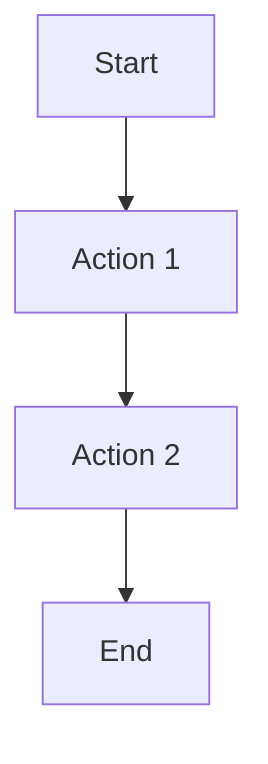
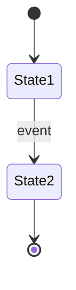
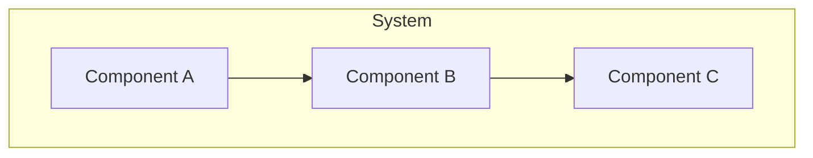
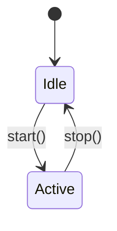

# Specification Templates

**Last updated:** 2026-01-19
**Purpose:** Provide standardized templates for creating specifications

## Doc requirements

- Audience: Specification authors
- Scope: Template structure and examples
- Non-scope: Spec content itself (see individual specs)
- Owner: Jamie Scott Craik (@jscraik)
- Review cadence: Quarterly

## PRD Template

```markdown
---
schema_version: 1
---

# PRD: [Feature Name]

**Owner:** [Name] (@username)
**Status:** Draft
**Last updated:** YYYY-MM-DD
**Stakeholders:** [List]

## Acceptance Criteria

- [ ] Criteria 1
- [ ] Criteria 2

## 0) PRD Summary

- **One-liner:** [Single sentence description]
- **Why now:** [Timing rationale]
- **Desired outcome:** [Success description]

## 1) Executive Summary

[2-3 paragraphs]

Provide a concise overview of:
- What problem we're solving
- Why it matters
- What success looks like

## 2) Problem Statement / Opportunity

### Current Situation

[Describe current state]

### Pain Points

- Pain point 1: [Description]
- Pain point 2: [Description]
- Pain point 3: [Description]

### Evidence

- User feedback: [Quotes, surveys]
- Analytics: [Data supporting problem]
- Support tickets: [Related issues]

## 3) Target Users / Personas

### Persona 1: [Name]

**Role:** [Job title]
**Goals:** [What they want to achieve]
**Pain Points:** [Frustrations]
**Behaviors:** [Observable actions]

> "[Direct quote from user or interview]"

### Persona 2: [Name]

[Same structure as Persona 1]

## 4) User Stories

### Story 1: [Title]

**As a** [persona],
**I want** [action],
**So that** [benefit].

**Acceptance Criteria:**
- [ ] Criterion 1
- [ ] Criterion 2
- [ ] Criterion 3

**Edge Cases:**
- [ ] Edge case 1
- [ ] Edge case 2

### Story 2: [Title]

[Same structure]

## 5) Functional Requirements

### Requirement 1: [Title]

**Description:** [What the system must do]

**Acceptance:**
- [ ] Requirement met
- [ ] Testable

### Requirement 2: [Title]

[Same structure]

## 6) Non-Functional Requirements

### Performance

- [ ] [Specific metric]

### Security

- [ ] [Security requirement]

### Accessibility

- [ ] WCAG 2.2 AA compliance

### Compliance

- [ ] [Compliance requirement]

## 7) Success Metrics / KPIs

| Metric | Baseline | Target | Measurement |
|--------|----------|--------|-------------|
| [Metric 1] | [Current] | [Target] | [How measured] |
| [Metric 2] | [Current] | [Target] | [How measured] |

## 8) Scope

### In Scope

- Feature 1
- Feature 2
- Feature 3

### Out of Scope

- Feature X (reason: [why])
- Feature Y (reason: [future work])

## 9) Dependencies

### Internal

- [Dependency 1]: [Impact if blocked]
- [Dependency 2]: [Impact if blocked]

### External

- [Dependency 1]: [Impact if blocked]
- [Dependency 2]: [Impact if blocked]

### Assumptions

- Assumption 1: [What we assume is true]
- Assumption 2: [What we assume is true]

## 10) Risks and Mitigations

| Risk | Impact | Probability | Mitigation |
|------|--------|-------------|------------|
| [Risk 1] | High/Med/Low | High/Med/Low | [Mitigation strategy] |
| [Risk 2] | High/Med/Low | High/Med/Low | [Mitigation strategy] |

## 11) Timeline / Milestones

| Milestone | Date | Dependencies |
|-----------|------|--------------|
| [Milestone 1] | YYYY-MM-DD | [What must be done first] |
| [Milestone 2] | YYYY-MM-DD | [What must be done first] |

## 12) Diagrams

### User Journey



### State Model



## 13) Assumptions & Open Questions

### Assumptions

- Assumption 1: [Description]
- Assumption 2: [Description]

### Open Questions

| Question | Owner | Due Date |
|----------|-------|----------|
| [Question 1] | @username | YYYY-MM-DD |
| [Question 2] | @username | YYYY-MM-DD |

## 14) PRD Integrity Rule

This PRD must NOT contain:
- Technical implementation details
- API specifications
- Database schemas
- Deployment procedures

These belong in the corresponding Tech Spec.

## 15) PRD Review Checklist

Before approval, ensure:
- [ ] All sections completed
- [ ] Self-review completed
- [ ] Peer review completed
- [ ] Product review completed
- [ ] All findings addressed

---
=== Debate Complete ===
```

## Tech Spec Template

```markdown
---
schema_version: 1
---

# Technical Specification: [Feature Name]

**Owner:** [Name] (@username)
**Status:** Draft
**Related PRD:** [Link to PRD]
**Release target:** YYYY-MM-DD

## Acceptance Criteria

- [ ] Criteria 1
- [ ] Criteria 2

## 0) Summary

**One-liner:** [Single sentence description]

**Goals:**
1. Goal 1
2. Goal 2

**Key Risks:**
- Risk 1: [Description and mitigation]
- Risk 2: [Description and mitigation]

**Rollout Plan:** [Phased rollout strategy]

## 1) Overview / Context

**Background:** [Why we're building this]

**Constraints:**
- Constraint 1: [Limitation]
- Constraint 2: [Limitation]

**Glossary:**
- Term 1: Definition
- Term 2: Definition

## 2) Goals and Non-Goals

### Goals

| Goal | Success Criteria | Measurement |
|------|-----------------|-------------|
| Goal 1 | [How we know it's done] | [How to measure] |
| Goal 2 | [How we know it's done] | [How to measure] |

### Non-Goals

- Non-goal 1: [Why not doing this]
- Non-goal 2: [Why not doing this]

## 3) System Architecture



**Architecture Decisions:**

| Decision | Rationale | Alternatives Considered |
|----------|-----------|-------------------------|
| Decision 1 | Why this choice | Option A, Option B |
| Decision 2 | Why this choice | Option A, Option B |

## 4) Component Design

### Component 1: [Name]

**Responsibility:** [What it does]

**Interface:**
```typescript
interface Component1Props {
  prop1: string;
  prop2: number;
}
```

**State Machine:**



### Component 2: [Name]

[Same structure]

## 5) API Design

### Endpoint 1: [Name]

**Method:** POST/GET/PUT/DELETE

**Path:** `/api/resource`

**Request:**
```json
{
  "field1": "string",
  "field2": "number"
}
```

**Response:**
```json
{
  "result": "string",
  "timestamp": "ISO8601"
}
```

**Errors:**
| Code | Description | Retry |
|------|-------------|-------|
| 400 | Invalid input | No |
| 500 | Server error | Yes |

## 6) Data Models / Database Schema

### Table: [table_name]

| Column | Type | Constraints | Index |
|--------|------|-------------|-------|
| id | UUID | Primary key | Yes |
| field1 | VARCHAR(255) | Not null | No |
| field2 | TIMESTAMP | Indexed | Yes |

### Relationships

- Table1 → Table2: One-to-many
- Table3 → Table4: Many-to-many

## 7) Infrastructure Requirements

### Runtime

- Node.js version: X.X.X
- Memory: X GB
- CPU: X cores

### Deployment

- Environment variables required:
  - VAR1: Description
  - VAR2: Description

## 8) Security Considerations

### Authentication

- [ ] Auth method required
- [ ] Token validation

### Authorization

- [ ] Role-based access
- [ ] Permission checks

### Secrets Management

- [ ] Secrets stored in keychain
- [ ] No hardcoded credentials

### Threats

| Threat | Mitigation |
|--------|------------|
| Injection | Parameterized queries |
| XSS | Input sanitization |

## 9) Error Handling Strategy

### Error Taxonomy

| Error Type | Example | Handling |
|------------|---------|----------|
| Validation | Invalid input | Return 400 with details |
| Not Found | Resource missing | Return 404 |
| Server | Unexpected error | Return 500, log details |

### Retry Logic

- Retry on: [Error codes]
- Max retries: X
- Backoff: [Strategy]

### Idempotency

- Idempotent operations: [List]
- Idempotency key: [Implementation]

## 10) Performance Requirements / SLAs

| Metric | Target | Measurement |
|--------|--------|-------------|
| P50 Latency | ≤Xms | [How measured] |
| P95 Latency | ≤Xms | [How measured] |
| Throughput | ≥X req/s | [How measured] |

## 11) Observability

### Logging

- Level: INFO/WARN/ERROR
- Format: JSON
- Fields: timestamp, level, message, context

### Metrics

| Metric | Type | Labels |
|--------|------|--------|
| requests_total | Counter | endpoint, status |
| request_duration | Histogram | endpoint |

### Dashboards

- Dashboard 1: [Purpose]
- Dashboard 2: [Purpose]

### Alerts

| Alert | Condition | Severity |
|-------|-----------|----------|
| High error rate | >5% | Critical |
| High latency | P95 > Xms | Warning |

## 12) Testing Strategy

### Unit Tests

- Framework: [Name]
- Coverage target: ≥80%

### Integration Tests

- Framework: [Name]
- Scenarios: [List]

### E2E Tests

- Framework: [Name]
- Critical paths: [List]

### Load Tests

- Tool: [Name]
- Target: [X req/s]

## 13) Deployment Strategy

### Build

- Command: `pnpm build`
- Artifacts: [List]

### Release

- Strategy: [Blue-green / Canary / Rolling]
- Steps:
  1. Step 1
  2. Step 2
  3. Step 3

### Feature Flags

- Flag 1: [Purpose]
- Flag 2: [Purpose]

### Rollback

- Procedure: [Steps]
- Time to rollback: ≤X minutes

## 14) Migration Plan

### Data Migration

- Source: [Current state]
- Target: [Desired state]
- Steps:
  1. Step 1
  2. Step 2
- Validation: [How to verify]

### Backward Compatibility

- Version supported: [Duration]
- Deprecation timeline: [Dates]

## 15) Operational Notes

### Runbook

- Common operations: [List]
- Troubleshooting: [Common issues and fixes]

### SLOs

See [SLOS.md](../../docs/operations/SLOS.md)

### Incident Response

See [INCIDENT_RESPONSE.md](../../docs/operations/INCIDENT_RESPONSE.md)

## 16) Open Questions / Future Considerations

### Open Questions

| Question | Owner | Due Date |
|----------|-------|----------|
| [Question 1] | @username | YYYY-MM-DD |

### Future Work

- Feature 1: [Description]
- Feature 2: [Description]

## 17) Tech Spec Quality Gate

Before approval, ensure:
- [ ] All sections completed
- [ ] Architecture diagram included
- [ ] SLOs defined
- [ ] Error handling documented
- [ ] Security considerations addressed
- [ ] Self-review completed
- [ ] Peer review completed

---
=== Debate Complete ===
```

## Usage

### Creating a New PRD

1. Copy PRD template
2. Save as `.spec/spec-YYYY-MM-DD-short-title.md`
3. Fill in all sections
4. Complete self-review
5. Submit for peer review

### Creating a New Tech Spec

1. Copy Tech Spec template
2. Save as `.spec/tech-spec-YYYY-MM-DD-short-title.md`
3. Reference corresponding PRD
4. Fill in all sections
5. Complete self-review
6. Submit for peer review

### Naming Conventions

- PRDs: `spec-YYYY-MM-DD-kebab-title.md`
- Tech Specs: `tech-spec-YYYY-MM-DD-kebab-title.md`
- Plans: `ExecPlan-YYYY-MM-DD.md`
- Reviews: `ADVERSARIAL_REVIEW_N.md`

## Related Documentation

- [SPEC_REVIEW_CHECKLIST.md](./SPEC_REVIEW_CHECKLIST.md) - Review criteria
- [SPEC_INDEX.md](./SPEC_INDEX.md) - Index of all specs
- [ExecPlan.md](./ExecPlan.md) - Execution plan examples

## License

See repository root for license information.
