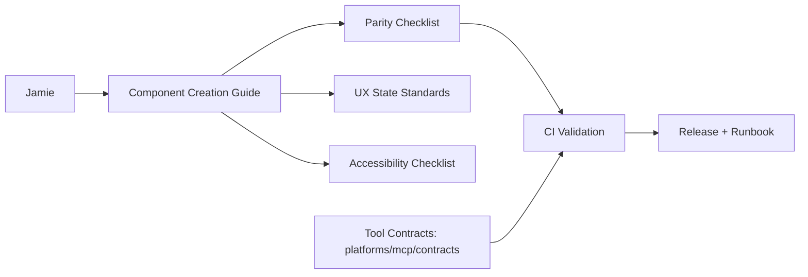
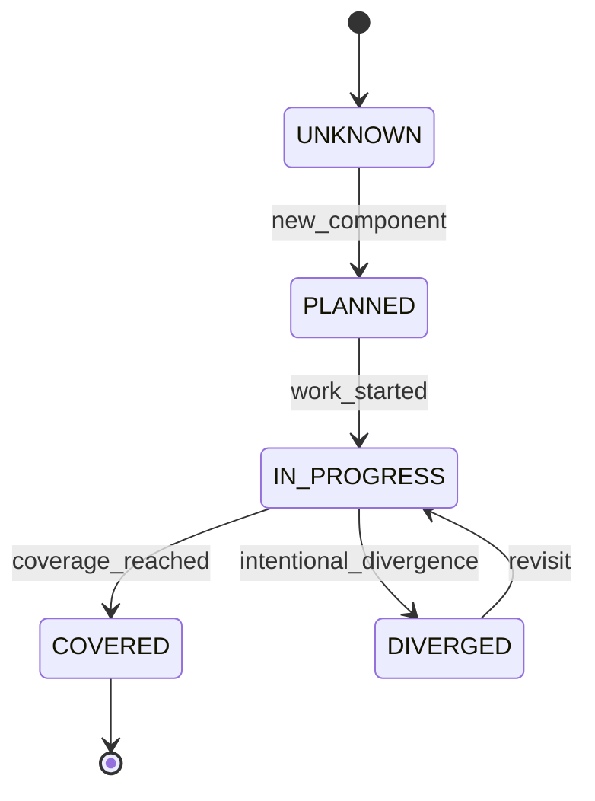

# Technical Specification: aStudio Component Creation & Coverage Governance

**Owner:** Jamie Scott Craik (@jscraik)  
**Status:** Draft  
**Last updated:** 2026-01-15  
**Related PRD:** specs/spec-2026-01-15-component-creation-governance.md  
**Repo / Tracking:** /Users/jamiecraik/dev/aStudio  
**Reviewers:** Jamie (solo)  
**Release target:** 2026-01-29

---

## Acceptance Criteria

- [ ] CI policy is updated with new validation checks and documentation targets.
- [ ] Coverage checklist and component guide are created and referenced from README/docs index.
- [ ] MCP tool contracts are validated via `pnpm test:mcp-contract` and required in release checks.
- [ ] Component creation guide covers React + Apps SDK UI surfaces, tokens, tests, and release steps.
- [ ] Coverage governance lifecycle states are defined and documented.
- [ ] MCP tool contract source-of-truth is defined under `platforms/mcp/contracts/` with allowlist auth policy.
- [ ] Runbook includes rollback steps for MCP + widgets and references the contract source-of-truth.
- [ ] Tech spec quality gate checklist is completed with all items checked.

---

## 0) Summary

- **One-liner:** Implement a unified component creation guide, coverage governance, and MCP contract policy with gold-standard quality gates.
- **Primary goal:** Cut component delivery time to ≤ 2 hours while maintaining coverage and consistency.
- **Key risks:** Documentation drift, coverage checklist ignored, lack of measurable signals.
- **Rollout shape:** Incremental documentation updates + CI gate adoption.

---

## 1) Overview / Context

### Context

The aStudio repo has mature UI components and surface coverage intent but scattered guidance and partial coverage across surfaces. This spec defines the concrete doc structure, validation points, and policy locations to standardize component creation, coverage updates, and MCP tool contract governance.

### Constraints

- Platform constraints: pnpm workspace, React/Vite/Tailwind, Apps SDK UI.
- Integration constraints: Must align with existing build pipeline and tests.
- Compliance constraints: None beyond WCAG 2.2 AA baseline.
- Operating constraints: Solo-dev ownership, limited CI time budget.

### Glossary (only if needed)

- Coverage checklist: A single, versioned list showing surface coverage and status.

---

## 2) Goals and Non-Goals

### Goals

- G1: Provide a single authoritative component creation guide.
- G2: Define coverage governance and lifecycle states for components.
- G3: Enforce MCP tool contract source-of-truth and allowlist auth policy.

### Non-Goals (required; RNIA — if N/A, say why)

- NG1: Full surface coverage across all components (out of scope for this phase).
- NG2: Redesign of existing UI components.

### Success criteria (engineering)

- CI policy updated with new checks and documentation targets.
- Coverage checklist and component guide referenced from README/docs index.
- MCP tool contracts validated via existing test command and referenced in runbook.

---

## 3) System Architecture

### Architecture diagram (Mermaid)

### Architectural decisions (with rationale)

- **Decision:** Centralize component creation guidance in a single doc.  
  **Rationale:** Reduces search cost and ambiguity.  
  **Alternatives:** Leave guidance distributed.  
  **Tradeoffs:** Requires ongoing maintenance.

- **Decision:** Place MCP tool contract spec under `platforms/mcp/contracts/` and reference it in runbooks.  
  **Rationale:** Keeps contract near MCP code and enables validation.  
  **Alternatives:** Store in `docs/runbook/` only.  
  **Tradeoffs:** Slight duplication risk if docs are not updated.

---

## 4) Component Design

### Component inventory

| Component                | Type       | Status  |
| ------------------------ | ---------- | ------- |
| Component Creation Guide | doc        | planned |
| Coverage Checklist       | doc        | planned |
| MCP Contract Spec        | doc/schema | planned |
| CI Validation            | pipeline   | current |

### Component: Component Creation Guide

**Status:** planned

**Responsibilities**

- Define end-to-end component creation steps (React + Apps SDK UI surfaces).
- Define UX state and accessibility requirements.
- Define definition-of-done checklist.

**Inputs**

- Existing docs and tooling references.

**Outputs**

- Updated doc with links and checklists.

**Owned data**

- Guidance content and workflow steps.

**Dependencies**

- docs/architecture/ui-structure-map.md
- docs/guides/UI_COMPONENT_TOOLING.md
- docs/architecture/cross-platform-design.md

#### State machine

State machine: N/A (documentation component is stateless).

#### Failure modes & recovery (Required)

- Failure: Guide goes stale.
  - Detection: Missing coverage updates or broken links.
  - Handling: Add doc review check to release checklist.
  - User impact: Slower component delivery.
  - Data impact: None.

### Component: Coverage Checklist

**Status:** planned

**Responsibilities**

- Track component surface coverage state.
- Provide quick visibility into coverage gaps.

**Inputs**

- Component additions and updates.

**Outputs**

- Updated checklist entries.

**Owned data**

- Component coverage status records.

**Dependencies**

- docs/architecture/cross-platform-design.md

#### State machine (Required for stateful components; RNIA with reason)

#### Failure modes & recovery (Required)

- Failure: Coverage status not updated.
  - Detection: Checklist unchanged while new components ship.
  - Handling: Require update in definition-of-done.
  - User impact: Hidden coverage gaps.
  - Data impact: Inaccurate roadmap.

---

## 5) API Design

### API overview

N/A — no new network APIs are introduced; changes are documentation and validation only.

---

## 6) Data Models / Database Schema

### Tables / Collections

N/A — no database changes. The MCP contract spec is a versioned JSON file stored in the repo.

#### MCP tool contract schema (file-based)

- File: `platforms/mcp/contracts/tools.json`
- Fields:
  - `name`: string (required)
  - `version`: semver string (required)
  - `description`: string (required)
  - `inputSchema`: JSON Schema (required)
  - `outputSchema`: JSON Schema (required)
- Constraints:
  - `version` must follow semver.
  - `name` must be unique.

---

## 7) Infrastructure Requirements

- Runtime: Node.js (pnpm workspace)
- Deployment: documentation + CI updates only
- Environments: dev | CI
- Config management: existing repo configs
- Secrets: none
- Networking: none
- Cost considerations: CI minutes and storage budget caps

---

## 8) Security Considerations (Required)

- Authentication: MCP tools restricted by allowlist in prod.
- Authorization: tool name + version allowlist; deny unknown tools.
- Encryption: N/A (no new data storage).
- Input validation: JSON schema validation for tool contracts.
- Secrets management: none in docs; avoid secrets in guides.
- Threats & mitigations:
  - T1: Unauthorized tool exposure → enforce allowlist policy.
  - T2: Schema drift → validate contracts in CI.
  - T3: Doc leakage of secrets → enforce no-secrets rule in docs.

---

## 9) Error Handling Strategy (Required)

- Error taxonomy: validation | policy | dependency | unknown
- Timeouts: N/A (doc-only changes)
- Retry policy: N/A
- Idempotency strategy: N/A
- Degraded mode: If validation fails, block release.
- User-facing error mapping: CI failures with actionable messages.

---

## 10) Performance Requirements / SLAs or SLOs (Required)

| SLI          |                         Target | Measurement                |
| ------------ | -----------------------------: | -------------------------- |
| p95 latency  | 500 ms (local), 1.5 s (remote) | tool logs                  |
| availability |                          99.5% | MCP monitoring             |
| throughput   |                            N/A | N/A (not a service change) |

## 10b) SLOs and Error Budget (Required or N/A with reason)

- SLIs chosen: availability, p95 latency
- SLO targets: 99.5% availability; p95 latency targets above
- Error budget window: 30 days
- Error budget policy: pause releases at 75% burn; rollback at 100% burn

---

## 11) Observability (Required)

- Logging:
  - Required fields: component, version, result, latency_ms
- Metrics:
  - Counters: tool_calls_total, tool_errors_total, widget_render_total, widget_render_errors_total
  - Histograms: tool_latency_ms
  - Gauges: coverage_gap_count
- Tracing: N/A (doc-only changes)
- Dashboards:
  - MCP tool health dashboard
  - Coverage gap tracking dashboard (manual or lightweight)
- Alerts:
  - Alert 1: error budget burn > 50% in 7 days → review and pause releases

---

## 12) Testing Strategy (Required)

- Unit tests: N/A (doc-only)
- Integration tests: MCP contract validation (`pnpm test:mcp-contract`) required for release checks
- E2E tests: N/A
- Load tests: N/A
- Security tests: existing CI security gates
- Test data strategy: N/A

---

## 13) Deployment Strategy (Required)

- Build & release: docs updates merged via PR
- Rollout: immediate on merge
- Feature flags: N/A
- Backward compatibility: ensure contract versions increment on breaking changes
- Rollback: revert doc commit; pin prior tool contract spec version
- Post-deploy verification: CI green + doc link checks

---

## 14) Migration Plan (if applicable)

- Step 1: Create component guide doc
- Step 2: Move coverage checklist into the guide
- Step 3: Add MCP contract spec and link in runbook
- Step 4: Update release checklist to include coverage + guide checks

---

## 15) Operational Notes (Recommended)

- Runbook: include MCP tool allowlist policy and contract spec references
- Manual operations: update coverage checklist when a component ships
- Support playbook: N/A (solo project)
- On-call readiness: solo dev checklist

---

## 16) Open Questions / Future Considerations (Required)

### Open questions

- Q1: Where should the component guide live (docs root vs guides)? (Owner: Jamie, Due: 2026-01-22)
- Q2: What minimal dashboard format best tracks coverage gaps? (Owner: Jamie, Due: 2026-01-29)

### Future considerations

- Add automated coverage extraction from code to reduce manual checklist work.

---

## 17) Tech Spec Quality Gate (Required)

- [ ] Architecture is clear and diagrammed
- [ ] Every stateful component has a state machine (or N/A + reason)
- [ ] APIs have complete schemas + errors
- [ ] Data model includes constraints and indexes
- [ ] Security threats are identified and mitigations listed
- [ ] Error handling covers timeouts, retries, idempotency, degraded modes
- [ ] Performance targets are numeric and measurable
- [ ] Observability includes logs, metrics, dashboards, alerts
- [ ] Deployment is repeatable and rollbackable
- [ ] No ambiguity left for implementers

---

=== Debate Complete ===
Document: Technical Specification
Rounds: 1
Models: PM, UI/UX, Frontend, API, Backend, Security, Reliability/SRE, Cost/Scale
Key refinements:

- No blocking issues identified; documents align with gold-standard baselines.
