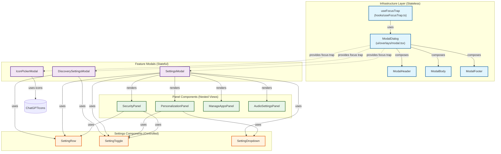
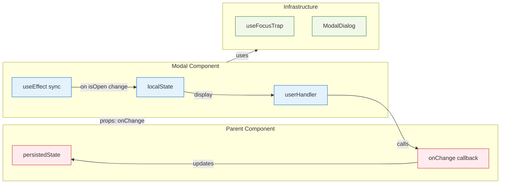
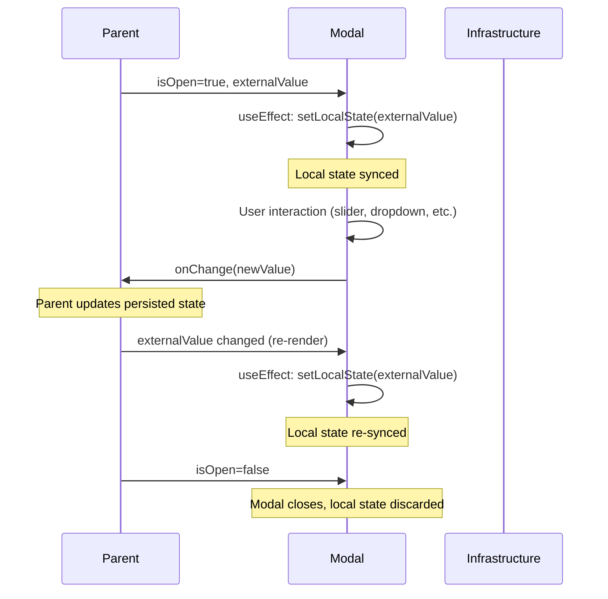
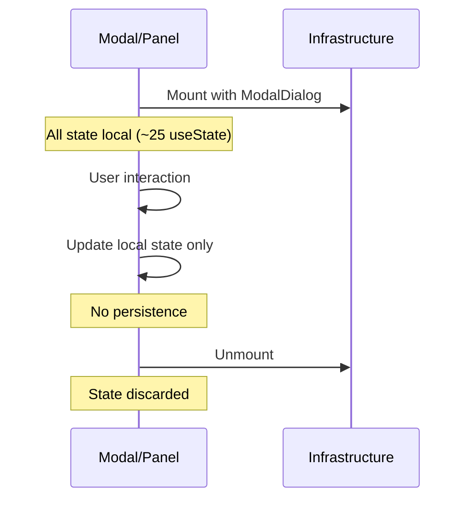
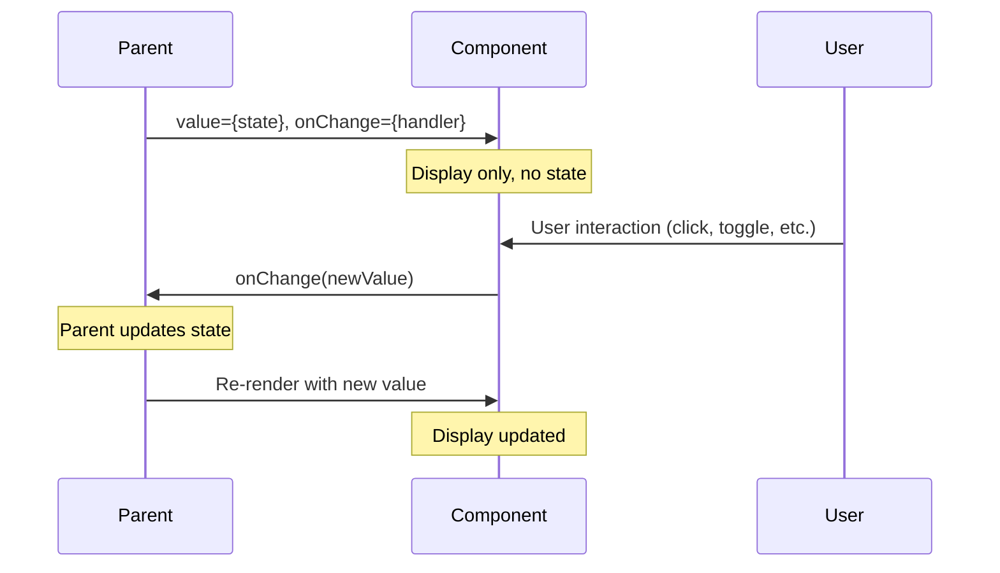
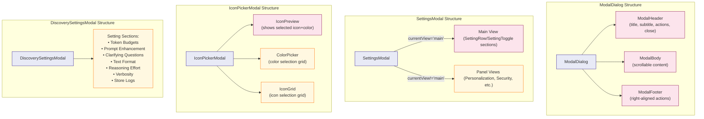
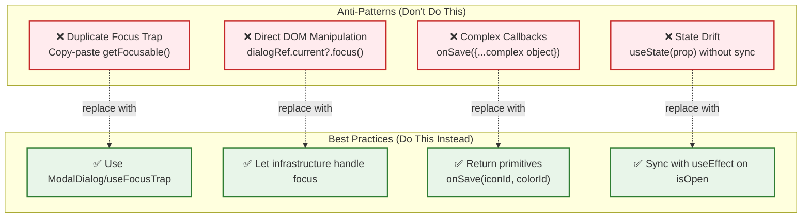
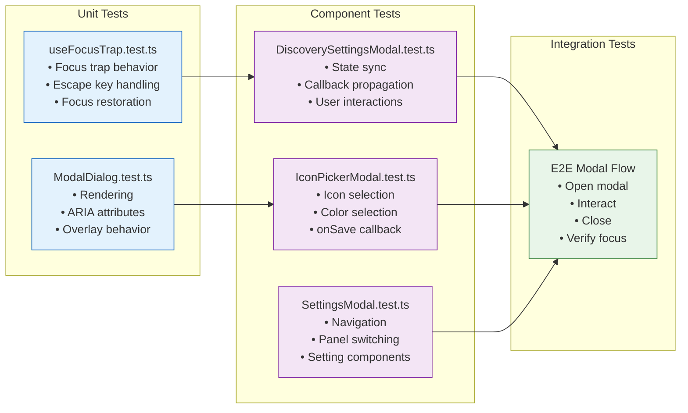
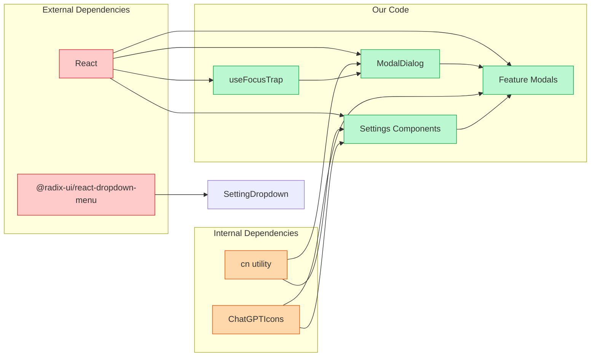

# Modal Module Boundaries (Mermaid)

Last updated: 2026-01-04

## Doc requirements
- Audience: Developers (intermediate)
- Scope: Topic defined by this document
- Non-scope: Anything not explicitly covered here
- Owner: TBD (confirm)
- Review cadence: TBD (confirm)

## Contents

- [Doc requirements](#doc-requirements)
- [Module Dependency Graph](#module-dependency-graph)
- [State Ownership Diagram](#state-ownership-diagram)
- [Data Flow Patterns](#data-flow-patterns)
  - [Pattern A: Synced State (DiscoverySettingsModal, IconPickerModal)](#pattern-a-synced-state-discoverysettingsmodal-iconpickermodal)
  - [Pattern B: Local-Only State (SettingsModal, Panels)](#pattern-b-local-only-state-settingsmodal-panels)
  - [Pattern C: Controlled Components (SettingRow, SettingToggle)](#pattern-c-controlled-components-settingrow-settingtoggle)
- [Component Architecture](#component-architecture)
- [Anti-Patterns to Avoid](#anti-patterns-to-avoid)
- [Testing Strategy](#testing-strategy)
- [File Structure](#file-structure)
- [Import Dependencies](#import-dependencies)

## Module Dependency Graph

## State Ownership Diagram

## Data Flow Patterns

### Pattern A: Synced State (DiscoverySettingsModal, IconPickerModal)

### Pattern B: Local-Only State (SettingsModal, Panels)

### Pattern C: Controlled Components (SettingRow, SettingToggle)

## Component Architecture

## Anti-Patterns to Avoid

## Testing Strategy

## File Structure

```mermaid
graph TB
    subgraph "packages/ui/src/"
        DIR1["hooks/"]
        DIR2["components/ui/overlays/"]
        DIR3["app/modals/"]
        DIR4["app/settings/"]
    end

    subgraph "Infrastructure Files"
        F1["useFocusTrap.ts"]
        F2["modal.tsx"]
    end

    subgraph "Modal Files"
        F3["DiscoverySettingsModal.tsx"]
        F4["IconPickerModal.tsx"]
        F5["SettingsModal.tsx"]
    end

    subgraph "Settings Files"
        F6["SettingRow.tsx"]
        F7["SettingToggle.tsx"]
        F8["SettingDropdown.tsx"]
        F9["PersonalizationPanel.tsx"]
        F10["SecurityPanel.tsx"]
        F11["ManageAppsPanel.tsx"]
        F12["AudioSettingsPanel.tsx"]
    end

    DIR1 --> F1
    DIR2 --> F2
    DIR3 --> F3
    DIR3 --> F4
    DIR3 --> F5
    DIR4 --> F6
    DIR4 --> F7
    DIR4 --> F8
    DIR4 --> F9
    DIR4 --> F10
    DIR4 --> F11
    DIR4 --> F12

    classDef dir fill:#faf5ff,stroke:#7c3aed
    classDef infra fill:#dbeafe,stroke:#2563eb
    classDef modal fill:#fce7f3,stroke:#db2777
    classDef setting fill:#fef3c7,stroke:#d97706

    class DIR1,DIR2,DIR3,DIR4 dir
    class F1,F2 infra
    class F3,F4,F5 modal
    class F6,F7,F8,F9,F10,F11,F12 setting
```

## Import Dependencies

