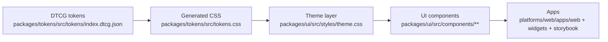

# Design System Flow

**Owner:** Jamie Scott Craik (@jscraik)  
**Last updated:** 2026-01-24

Notes:
- Tokens remain the source of truth; UI uses utilities mapped via `@theme inline`.
- Apps import Tailwind and token CSS at the entry stylesheet.
