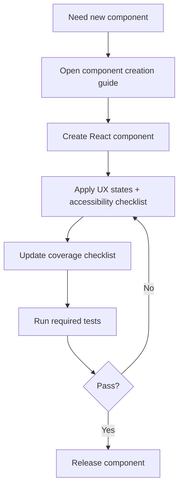
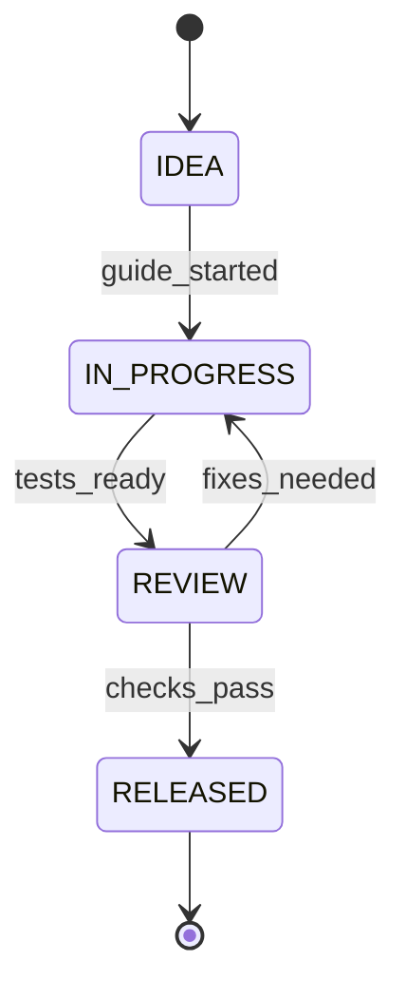

# PRD: aStudio Component Creation Governance

**Owner:** Jamie Scott Craik (@jscraik)  
**Status:** Draft  
**Last updated:** 2026-01-15  
**Stakeholders:** Jamie (solo dev)  
**Links:** .spec/PROJECT_REVIEW_REPORT.md | docs/architecture/ui-structure-map.md | docs/guides/UI_COMPONENT_TOOLING.md | docs/architecture/cross-platform-design.md | docs/architecture/repo-map.md

> Rule: If a section is not applicable, write `N/A` and explain why in 1–2 lines.

---

## Acceptance Criteria

- [ ] A single component creation guide exists at `docs/guides/COMPONENT_CREATION.md` and covers React + Apps SDK UI surfaces, tokens, tests, and release steps in one place.
- [ ] Coverage checklist source-of-truth is `docs/design-system/COVERAGE_MATRIX.md` (generated) and is linked from the component guide; updates are required on new component PRs.
- [ ] Guide and checklist ownership, review cadence, and definition-of-done linkage are documented in `docs/guides/COMPONENT_CREATION.md`.
- [ ] A required UX state taxonomy is documented with validation steps (see Section 5.1).
- [ ] Accessibility checks are documented and required for new components with a manual audit cadence and evidence artifact (see Section 6.3).
- [ ] Definition of done includes coverage updates, UX states, test evidence, and release verification steps (see Section 6.1).
- [ ] MCP tool contract source-of-truth location is documented and referenced in `docs/operations/RUNBOOK.md`.
- [ ] Rollback steps for MCP + widgets are documented in `docs/operations/RUNBOOK.md`.
- [ ] Telemetry events are defined for widget renders and MCP tool calls, with target KPIs and data governance (see Section 6.2).
- [ ] SLO targets and error budget policy are documented in `docs/operations/SLOS.md`.
- [ ] MCP tool contracts are validated in CI and referenced in release checks (implementation details in Tech Spec).

## 0) PRD Summary

- **One-liner:** A single, repeatable component-creation workflow and consistency governance process for Jamie to build consistent React + Apps SDK UI components quickly.
- **Why now:** Current guidance is scattered and surface coverage is partial; the solo workflow needs standardization to cut component delivery time.
- **Desired outcome:** Reduce median time-to-ship for new components from ~48 hours to ≤ 2 hours while improving UI consistency and coverage tracking.

---

## 1) Executive Summary

Jamie is building a design-system-first UI workbench across React and Apps SDK UI surfaces. Today, component creation is slowed by scattered guidance and partial coverage across surfaces. This PRD defines a unified component creation workflow and consistency governance that allows a solo developer to ship components faster without sacrificing consistency or accessibility.

The change introduces a single source of truth for “how to create a component,” explicit coverage tracking, and measurable quality gates for UX states, accessibility, and consistency. Success will be measured by reduced time-to-ship, fewer visual regressions, and higher surface coverage. This PRD does not introduce new product features for end users; it focuses on developer productivity and quality.

Out of scope are non-UI backend services, unrelated product features, and any redesign of Apps SDK UI foundations. Technical implementation details are captured in the accompanying Tech Spec.

---

## 2) Problem Statement / Opportunity

### 2.1 Problem

- **Who is affected:** Jamie (solo developer maintaining aStudio’s UI system)
- **Pain today:** Component creation requires hopping across multiple docs; coverage decisions are inconsistent and time-consuming.
- **Current workaround:** Manual search across guides and architecture docs; ad-hoc coverage decisions.
- **Impact if we do nothing:** Component delivery stays slow (~48 hours), coverage gaps grow, and UI inconsistencies persist.

### 2.2 Evidence (required)

- Baseline median time-to-ship per component: ~48 hours (solo dev estimate).
- Surface coverage documentation shows core React components complete while widget and desktop usage still lags.
- Guidance is scattered across multiple docs with no single “end-to-end” workflow.

### 2.3 Opportunity

- **What improves if solved:** Faster component delivery, fewer UI regressions, and a clear coverage roadmap.
- **Why we’re well-positioned:** Existing architecture, tooling (`pnpm new:component`), and coverage docs can be unified into a single workflow.

---

## 3) Target Users / Personas

> Personas must be specific. Each persona should have real context + pain.

| Persona | Role              | Context                                        | Goals                           | Pain points                                 |
| ------- | ----------------- | ---------------------------------------------- | ------------------------------- | ------------------------------------------- |
| Jamie   | Solo UI developer | Builds components across React + Apps SDK UI   | Ship components quickly         | Scattered guidance, unclear surface coverage |

**Primary user(s):** Jamie (solo dev)  
**Secondary user(s):** N/A — single-user project.

---

## 4) User Stories

### 4.1 Core user stories (MVP)

1. **Story [STORY-001]:** As Jamie, I want a single component creation guide so that I can build new components consistently without hunting across docs.  
   **Acceptance criteria:**
   - [ ] The guide covers React + Apps SDK UI surfaces, tokens, tests, and release steps in one place.
   - [ ] The guide references existing tooling and required docs.
         **Priority:** Must

2. **Story [STORY-002]:** As Jamie, I want a surface coverage checklist so that I can track where components are used across web, widgets, and desktop.  
   **Acceptance criteria:**
   - [ ] Coverage checklist is linked from the component guide.
   - [ ] Coverage status is updated for new components.
         **Priority:** Must

3. **Story [STORY-003]:** As Jamie, I want standardized UX state requirements so that every component ships with consistent loading/empty/error states.  
   **Acceptance criteria:**
   - [ ] A required list of UX states is documented for new components.
   - [ ] The guide includes how to validate these states.
         **Priority:** Must

4. **Story [STORY-004]:** As Jamie, I want an accessibility checklist so that every component meets WCAG 2.2 AA expectations.  
   **Acceptance criteria:**
   - [ ] Accessibility checks are documented and required for new components.
   - [ ] The guide defines a manual audit cadence per release.
         **Priority:** Must

5. **Story [STORY-005]:** As Jamie, I want a clear definition of done so that I can ship components quickly without rework.  
   **Acceptance criteria:**
   - [ ] Definition of done includes coverage, UX states, and test evidence.
   - [ ] The guide includes release verification steps.
         **Priority:** Should

6. **Story [STORY-006]:** As Jamie, I want a widget dev checklist so that widget components ship with consistent UX states and telemetry.  
   **Acceptance criteria:**
   - [ ] Widget dev steps include render success instrumentation and error capture.
   - [ ] Widget build + validation steps are referenced from the guide.
         **Priority:** Must

7. **Story [STORY-007]:** As Jamie, I want MCP tool contract validation baked into the workflow so that tool changes are safe and versioned.  
   **Acceptance criteria:**
   - [ ] Contract source-of-truth and versioning rules are linked from the guide.
   - [ ] `pnpm test:mcp-contract` is required before release checks pass.
         **Priority:** Must

8. **Story [STORY-008]:** As Jamie, I want a desktop surface checklist so that desktop usage stays aligned with the design system.  
   **Acceptance criteria:**
   - [ ] Desktop usage notes reference the same component guide and coverage checklist.
   - [ ] Desktop-specific gaps are recorded in coverage status.
         **Priority:** Should

### 4.2 Use case narratives (recommended)

- **Use case A:** Jamie starts a new component → uses the centralized guide → completes React component + coverage checklist → updates surface coverage status → ships with test evidence.
- **Use case B:** Jamie updates a component → uses the checklist to ensure no UX state regression → runs required tests → releases confidently.
- **Use case C:** Jamie ships a widget update → runs contract validation + widget checks → confirms telemetry baseline → releases.

---

## 5) Functional Requirements

### Journey: Component creation

- FR-1: Provide a single, end-to-end component creation guide. (Priority: Must)
- FR-2: Include coverage checklist and update workflow. (Priority: Must)
- FR-3: Document UX state requirements and validation steps. (Priority: Must)
- FR-4: Define a clear “definition of done” for component releases. (Priority: Should)

### Edge cases & failure UX (required)

- If a component lacks a widget or desktop usage example, the guide defines how to record the coverage gap.
- If a component lacks required UX states, the guide blocks release until states are defined.
- If accessibility checks fail, the guide requires remediation before release.

### 5.1 UX State Taxonomy (required)

Minimum required states per component:

- Initial loading (skeleton or spinner, defined by component)
- Background refresh / stale data
- Empty state with next action (if applicable)
- No-results state (for search/filter contexts)
- Error state with recovery path (retry, fallback, or contact)
- Permission/entitlement denied (if applicable)
- Offline or degraded mode (if applicable)
- Success confirmation (for action components)

Validation evidence must be captured in component stories or test artifacts (see Section 6.1).
---

## 6) Non-Functional Requirements

- **Performance:** N/A — documentation-only change; performance budgets are defined in Tech Spec.
- **Reliability:** The guidance must be stable and versioned with the repo.
- **Security & privacy:** No sensitive data; ensure no secrets are embedded in docs.
- **Compliance:** N/A — no regulated data.
- **Accessibility:** WCAG 2.2 AA baseline for component guidance.
- **Observability expectation:** Track component creation time and regressions via repo metrics and CI reports.

### 6.1 Governance & Definition of Done (required)

- **Owner:** Jamie (primary); **Backup owner:** TBD (record in guide when available).
- **Review cadence:** every release or monthly (whichever is sooner).
- **Gate:** PR template and release checklist must include DoD checklist; missing items block release.
- **Definition of Done checklist (minimum):**
  - Component guide updated or referenced
  - Coverage matrix updated (or gap recorded)
  - UX state stories or test artifacts exist for required states
  - Accessibility checks complete with audit artifact
  - Release verification steps completed

### 6.2 Telemetry Data Governance (required)

- **Event schema location:** Documented in `docs/operations/RUNBOOK.md` (Telemetry section).
- **Allowed fields:** component name, surface (web/widget/desktop), state, duration bucket, success/failure.
- **Prohibited fields:** user identifiers, raw content, prompts, PII.
- **Retention:** define window and deletion policy in runbook.
- **Access control:** restrict to repo owners; document access list.

### 6.3 Accessibility Verification (required)

- **Automated checks:** keyboard navigation, focus-visible, color contrast, label/name/role/value.
- **Manual audit cadence:** every release; scope limited to new or modified components.
- **Evidence artifact:** store audit checklist output in `docs/operations/` (format defined in guide).
---

## 7) Success Metrics / KPIs

| Metric                                |                                   Target | Measurement method  | Source                 |
| ------------------------------------- | ---------------------------------------: | ------------------- | ---------------------- |
| Time to new component (idea → merged) |             Baseline: 48h → Target: ≤ 2h | PR timestamps       | PR history + changelog |
| Component reuse rate                  | ≥ 70% of new UI from existing components | repo stats audit    | manual audit + scripts |
| UI consistency regressions            |             ≤ 2 visual diffs per release | visual test reports | CI visual regression   |
| MCP tool call success rate            |                                 ≥ 99.5% | MCP logs            | MCP server telemetry   |
| Widget render success rate            |                                 ≥ 99.5% | widget telemetry    | client instrumentation |
| Accessibility regression rate         |      0 WCAG 2.2 AA violations at release | a11y test + audit   | CI + manual audit      |

**Measurement window:** 30 days post-adoption

### Guardrails (required)

- CI pass rate must not regress below 95%.
- Widget build time P95 must stay ≤ 5 minutes.
- MCP tool response P95 must stay ≤ 500 ms (local) / ≤ 1.5 s (remote).

---

## 8) Scope

### In scope

- Centralized component creation guide (React + Apps SDK UI surfaces + tokens + tests)
- Coverage checklist and update workflow
- UX state requirements and definition of done
- Governance for guide + checklist ownership and review cadence
- Operational readiness updates for MCP contracts and rollback guidance
- Telemetry + SLO definitions and governance documentation (no instrumentation changes)

### Out of scope (required)

- New UI components or features beyond documentation/process updates
- Changes to Apps SDK UI or design tokens
- Telemetry instrumentation or runtime behavior changes

### Non-goals (recommended)

- Full surface coverage in this phase
- Redesign of existing components

---

## 9) Dependencies

### Internal

- Existing docs: UI tooling guide, coverage docs, UI structure map
- Existing ops docs: runbook + release checklists
- CI test reports and release workflows

### External

- N/A — no external vendors required

### Assumptions about dependencies (required)

- The existing `pnpm new:component` workflow remains available.
- The coverage docs remain the canonical source for coverage tracking.

---

## 10) Risks and Mitigations

| Risk                     | Likelihood | Impact | Mitigation                                              |
| ------------------------ | ---------- | ------ | ------------------------------------------------------- |
| Guide becomes stale      | Med        | Med    | Add review cadence and update checklist in release flow |
| Coverage checklist ignored | Med        | High   | Make coverage update part of definition of done         |
| Metrics not captured     | Med        | Med    | Add simple tracking in CI and changelog review          |
| MCP rollback missing     | Med        | High   | Require rollback steps in runbook and release checklist |
| Governance drift         | Med        | Med    | Set owner + review cadence in guide and release process |

---

## 11) Timeline / Milestones (optional)

| Milestone               | Date       | Notes                       |
| ----------------------- | ---------- | --------------------------- |
| Draft guide + checklist | 2026-01-22 | First version in repo       |
| Review + iterate        | 2026-01-29 | Apply feedback and finalize |

---

## 12) Diagrams & Clarity Checks (recommended)

### 12.1 User journey flow (Mermaid)

### 12.2 State model (Mermaid)

---

## 13) Assumptions & Open Questions (required)

### Assumptions

- A-1: Jamie remains the sole maintainer of the component workflow.
- A-2: Current coverage docs remain the authoritative source.

### Open questions

- Q-1: Where will coverage status be displayed for fastest access? (Owner: Jamie, Due: 2026-01-22)
- Q-2: What is the preferred location for the consolidated guide? (Owner: Jamie, Due: 2026-01-22)

---

## 14) PRD Integrity Rule (required)

- This PRD defines **WHAT / WHY / WHO**.
- It must **not** prescribe technical implementation details (databases, frameworks, service topology, specific libraries, etc.).
- If any technical detail seems unavoidable, move it to the Tech Spec and reference it from here.

---

## 15) PRD Review Checklist (required)

- [ ] Problem statement is clear and evidence-backed
- [ ] Personas are specific and pains are real
- [ ] Stories follow “As a… I want… so that…”
- [ ] Acceptance criteria are observable/testable
- [ ] Success metrics have numeric targets + measurement method
- [ ] Scope includes explicit OUT
- [ ] Dependencies listed with assumptions
- [ ] Risks are realistic and mitigations exist
- [ ] No technical implementation details
